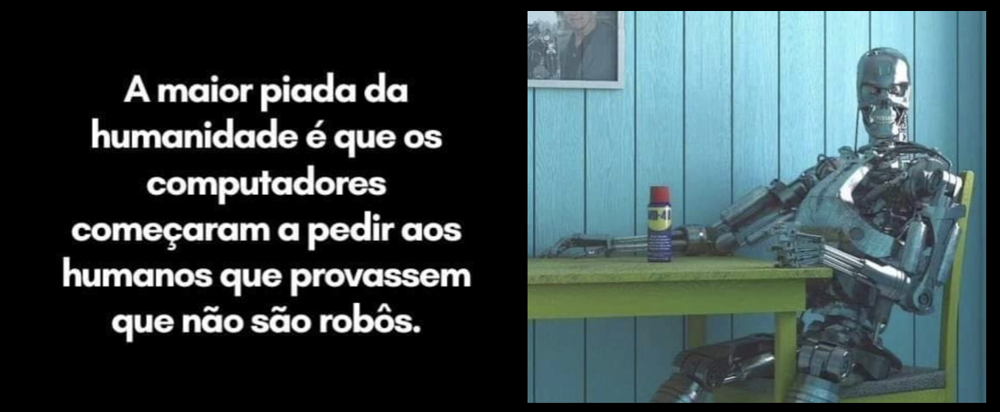
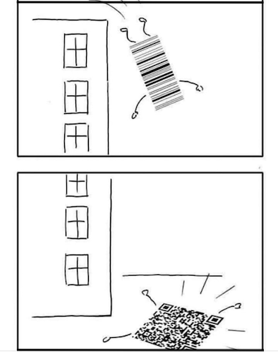

# Apresentação do Professor

   

        Nome: Dalton Solano dos Reis
        Contato: dalton@furb.br
        WhatsApp: (47) 99101-2777  
  

        1988-1992: Graduação na FURB (primeira turma de Computação)
        1994-1997: Mestrado (M.Sc.) na UFRGS .. Área Gráfica
        2003-xxxx: Doutorado (Dr.) na UFRGS .. Área Gráfica

## Resumo

Graduado em Bacharel Em Ciências da Computação pela FURB (1992) e mestrado em Computação pela UFRGS (1997). Atualmente é professor titular da FURB. Tem experiência na área de Ciência da Computação, com ênfase Computação Gráfica, atuando principalmente nos seguintes temas: Computação Gráfica, Realidade Virtual, Jogos e Aplicações móveis, e desenvolvimento de material educacional explorando Tecnologias de Desenvolvimento de Sistemas Aplicadas à Educação.

## Já lecionei

1a fase - Introdução à Computação  
1a fase - Introdução à Programação  
2a fase - Lógica para Computação  
4a fase - Compiladores  
7a fase - Computação Gráfica  
7a fase - Sistemas Multimídia  
8a fase - Desenvolvimento para Plataformas Móveis  
8a fase - Trabalho de Conclusão de Curso I BCC  
8a fase - Trabalho de Conclusão de Curso I SIS  

## Leciono atualmente

[1a fase - Introdução à Programação](https://github.com/dalton-reis/disciplina_IP_2024_2_A "1a fase - Introdução à Programação")  
[7a fase - Computação Gráfica (BCC-N)](https://github.com/dalton-reis/disciplina_CG_2024_2 "7a fase - Computação Gráfica (BCC-M\/BCC-N)")  
[8a fase - Realidade Virtual (BCC-N)](https://github.com/dalton-reis/disciplina_RV_2024_2 "8a fase - Realidade Virtual (BCC-N)")  
[8a fase - Trabalho de Conclusão de Curso I (BCC-N)](https://github.com/dalton-reis/disciplina_TCC1_2024_2/tree/main/_BCC "8a fase - Trabalho de Conclusão de Curso I (BCC-N)")  
[7a fase - Trabalho de Conclusão de Curso I (SIS-N)](https://github.com/dalton-reis/disciplina_TCC1_2024_2/tree/main/_SIS "7a fase - Trabalho de Conclusão de Curso I (SIS-N)")  

## Profissional

        1989/XXXX - Início na FURB  
        2022/XXXX - Chefe do Departamento de Sistemas e Computação (DSC)  

## Linhas pesquisa

<!-- TODO: arrumar formatação -->
Projetos relacionados com as disciplinas (área gráfica)  
Assuntos relacionados com a área da educação  
[Pensamento Computacional na Educação Básica](<https://youtu.be/gfks3z1zsYk> "Pensamento Computacional na Educação Básica")  

## Grupos de Pesquisa

[LDTT Instagram](https://www.instagram.com/p/C74ev_HpiHt/?igsh=M2dmMGM5N29nZmNv&img_index=1 "LDTT Insta - Laboratório de Desenvolvimento e Transferência de Tecnologia")  
[LDTT LinkedIn](https://www.linkedin.com/company/laboratorio-de-desenvolvimento-e-transferência-tecnologica/ "LDTT LinkedIn")  
[LDTT - <https://www.furb.br/furbot>](https://www.furb.br/furbot "LDTT - Laboratório de Desenvolvimento e Transferência de Tecnologia")  
[Habitat - <http://www.furb.br/habitat>](http://www.furb.br/habitat "Habitat - Educação, Inovação e Meio Ambiente")  
[TecEdu - <https://tecedufurb.github.io/portal/>](https://tecedufurb.github.io/portal/ "grupo de pesquisa TecEdu")  
[GCG - <https://github.com/gcgfurb/portal/>](https://github.com/gcgfurb/portal/ "grupo de pesquisa GCG")  

- Zotero bibliografias:
        [<https://www.zotero.org/daltonreis>](https://www.zotero.org/daltonreis "Zotero")  

- WebPage:
        [<https://dalton-reis.github.io/dalton-reis/>](https://dalton-reis.github.io/dalton-reis/ "WebPage")  

- Currículo Lattes <http://lattes.cnpq.br/4744915461420609>

- Oportunidade para fazer pesquisa: ser bolsista  

## Orgulho

### Parque Spitz - Balonismo Virtual

<https://www.linkedin.com/feed/update/urn%3Ali%3Aactivity%3A7207500112627920896/?midToken=AQG-otX11vVbsA&midSig=3PHEzFG-Ay0Xk1&trk=eml-email_notification_single_mentioned_you_in_this_01-hero_notification_cta-0-1ep~cta&trkEmail=eml-email_notification_single_mentioned_you_in_this_01-hero_notification_cta-0-1ep~cta-null-agsv~lxf86qfa~m4-null-null&eid=agsv-lxf86qfa-m4>

### Jogo - Play Grand Gate

"Salve galera, divulgando aqui mais uma atualização do meu jogo, agora demos um Rebrand. Daqui uma semana abre inscrições para um *Playtest* lá na Steam. Espero que gostem!! Segue trailer e site.  
<https://youtu.be/xQJtkhgJhto>  
<https://store.steampowered.com/app/2066370/Grand_Gate/>  

Um dos desenvolvedores foi meu aluno (Bruno Fischer Ferreira Santos), orientando de TCC, e hoje colega pesquisador em projetos no [LDTT](<http://www.furb.br/ldtt> "LDTT").

## Meu gosto tecnológico
  
        Curiosidade em como as coisas acontecem  
        Brinquedinhos tecnológicos da computação  
        Novidades que facilitam o nosso dia-a-dia  
        Área Gráfica: desde que comecei a trabalhar aos 14 anos com desenho técnico
         de projetos arquitetônicos  

## Ferramentas

Para saber quais ferramentas usamos para montar o material das disciplinas ver:

- <https://github.com/LDTTFURB/site/tree/main/ProjetosEnsino/Topicos/PlantUML>  
- <https://github.com/LDTTFURB/site/tree/main/ProjetosEnsino/Topicos/DrawIO>  
- <https://github.com/LDTTFURB/site/tree/main/ProjetosEnsino/Topicos/Latex>  

## VSCode

<https://github.com/LDTTFURB/site/tree/main/ProjetosEnsino/Topicos/VSCode>  

## Markdown

<https://github.com/LDTTFURB/site/tree/main/ProjetosEnsino/Topicos/Markdown>  

## GitHub

<https://github.com/LDTTFURB/site/tree/main/ProjetosEnsino/Topicos/Git>  

## GitHub Organizações

[Pessoal](https://github.com/dalton-reis?tab=repositories)  
[GCG](https://github.com/orgs/gcgfurb/repositories)  
[TecEdu](https://github.com/orgs/tecedufurb/repositories)  
[LDTT](https://github.com/orgs/LDTTFURB/repositories)  
[Habitat](https://github.com/orgs/HabitatFURB/repositories)  

## APKs

[APKs](https://drive.google.com/drive/folders/1fSPLd9Pn71gNQ7FQ6ZIunvArKg2a4u0W?usp=sharing)  

----
<video controls src="_._/Simpsons_Couch-Gag-iPhone.mp4" title="Title"></video>  

  

Minha mesa de trabalho ...  
  

Sabes como surgiu o QRCode?  
Na verdade ele veio de um Código de Barra que tentou o suicídio 😁.  

## WakaTime

  

  

[Wakatime DashBoard](<https://wakatime.com/@dalton_reis/projects/jaxdrmqjfo?start=2021-11-03&end=2021-11-09> "Wakatime DashBoard")
