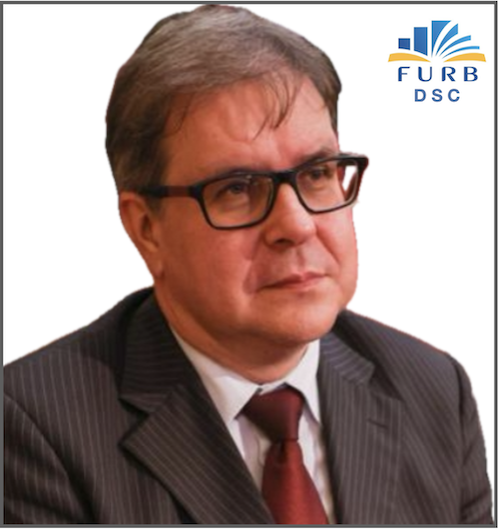

# Apresentação do Professor

   

        Nome: Dalton Solano dos Reis
        Contato: dalton@furb.br

        1988-1992: Graduação na FURB (primeira turma de Computação)
        1994-1997: Mestrado (M.Sc.) na UFRGS .. Área Gráfica
        2003-xxxx: Doutorado (Dr.) na UFRGS .. Área Gráfica

- Resumo: Graduado em Bacharel Em Ciências da Computação pela FURB (1992) e mestrado em Computação pela UFRGS (1997). Atualmente é professor titular da FURB. Tem experiência na área de Ciência da Computação, com ênfase Computação Gráfica, atuando principalmente nos seguintes temas: Computação Gráfica, Realidade Virtual, Jogos e Aplicações móveis, e desenvolvimento de material educacional explorando Tecnologias de Desenvolvimento de Sistemas Aplicadas à Educação.

- Já lecionei:
        1a fase - Introdução à Computação  
        1a fase - Introdução à Programação  
        2a fase - Lógica para Computação  
        4a fase - Compiladores  
        7a fase - Sistemas Multimídia  
        8a fase - Desenvolvimento para Plataformas Móveis  

- Leciono atualmente:

        7a fase - Computação Gráfica  
        8a fase - Realidade Virtual  
        8a fase - Trabalho de Conclusão de Curso I  

- Profissional

        1989/XXXX - Início na FURB  
        2022/XXXX - Chefe do Departamento de Sistemas e Computação (DSC)  

- Linhas pesquisa:

<!-- TODO: arrumar formatação -->
Projetos relacionados com as disciplinas (área gráfica)  
Assuntos relacionados com a área da educação  
[Pensamento Computacional na Educação Básica](<https://youtu.be/gfks3z1zsYk> "Pensamento Computacional na Educação Básica")  

- Grupos de Pesquisa:  
        [LDTT - <https://furbotldtt.wixsite.com/my-site-1>](https://furbotldtt.wixsite.com/my-site-1 "LDTT - Laboratório de Desenvolvimento e Transferência de Tecnologia")  
        [Habitat - <http://www.furb.br/habitat>](http://www.furb.br/habitat "Habitat - Educação, Inovação e Meio Ambiente")  
        [TecEdu - <http://tecedu.inf.furb.br/>](http://tecedu.inf.furb.br/ "grupo de pesquisa TecEdu")  
        [GCG - <http://gcg.inf.furb.br/>](http://gcg.inf.furb.br/ "grupo de pesquisa GCG")  
- Zotero:
        [<https://www.zotero.org/daltonreis>](https://www.zotero.org/daltonreis "Zotero")  

- WebPage:
        [<https://dalton-reis.github.io/dalton-reis/>](https://dalton-reis.github.io/dalton-reis/ "WebPage")  

- Oportunidade para fazer pesquisa: ser bolsista  

- Meu gosto tecnológico ..
  
        Curiosidade em como as coisas acontecem  
        Brinquedinhos tecnológicos da computação  
        Novidades que facilitam o nosso dia-a-dia  
        Área Gráfica: desde que comecei a trabalhar aos 14 anos com desenho técnico
         de projetos arquitetônicos  

- VSCode

As extensões que eu uso no VSCode (22/06/2022): [Extensões](_._/VSCode/VsCodeExtensoes.md "Extensões")  

Caso queira listar quais extensões está usando pode usar os comando em:  
Unix:  
> code --list-extensions | xargs -L 1 echo code --install-extension

Windows (PowerShell, e. g. using Visual Studio Code's integrated Terminal):  
> code --list-extensions | % { "code --install-extension $_" }
----

## WakaTime

  

  

[Wakatime DashBoard](<https://wakatime.com/@dalton_reis/projects/jaxdrmqjfo?start=2021-11-03&end=2021-11-09> "Wakatime DashBoard")
