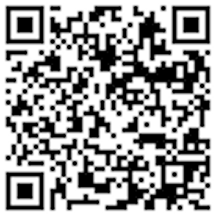

# DSC - Concursos PSPS 2024_2

Estão abertas as inscrições para os concursos de Professor Universitário em Caráter Temporário (PSPS) do Departamento de Sistemas e Computação (DSC) da Universidade Regional de Blumenau (FURB).  

Qualquer dúvida favor entrar em contato com prof. Dalton Reis (<dalton@furb.br>), chefe do DSC.  

## Área Temática: Banco de Dados

Edital N° 051/2024  
As inscrições serão realizadas nos dias 04 a 10 de junho de 2024  
Prova Didática 27/06/2024 14h - Campus I - Sala S - 401  
Edital: <https://anexos.cdn.selecao.net.br/uploads/342/concursos/357/anexos/qw9E3e3Ykh8zQwMoPfhsRfEJU9XyAaCnE1Ouldy1.pdf>  
Lote: <https://concursos.furb.br/informacoes/357/>  

## Área Temática: Hardware

Edital N° 027/2024  
As inscrições serão realizadas nos dias 16 a 22 de maio de 2024  
Prova Didática 05/06/2024 14h - Campus I - Sala S - 401  
Edital: <https://anexos.cdn.selecao.net.br/uploads/342/concursos/352/anexos/1CHy8ehnvb7FdObVqFK5I4yP1WmJ9NGAWblPevzC.pdf>  
Lote: <https://concursos.furb.br/informacoes/352/>  

## Área Temática: Programação de Computadores

Edital N° 021/2024  
As inscrições serão realizadas nos dias 13 a 17 de maio de 2024  
Prova Didática 29/05/2024 14h - Campus I - Sala S - 401  
Edital: <https://anexos.cdn.selecao.net.br/uploads/342/concursos/351/anexos/qPrXCl2vqaMdreBmVx13sV8xVmSgWHCUDl5t78TH.pdf>  
Lote: <https://concursos.furb.br/informacoes/351/>  

## Área Temática: Redes de Computadores

Edital N° 040/2024  
As inscrições serão realizadas nos dias 23 a 29 de maio de 2024  
Prova Didática 12/06/2024 14h - Campus I - Sala S - 401  
Edital: <https://anexos.cdn.selecao.net.br/uploads/342/concursos/356/anexos/OKnFRLOKGHkuSufmFzYP008w5n3dUoTaJSSgASAu.pdf>  
Lote: <https://concursos.furb.br/informacoes/356/>  

## Área Temática: Sistemas de informação

Edital N° 048/2024  
As inscrições serão realizadas nos dias 04 a 10 de junho de 2024  
Prova Didática 20/06/2024 14h - Campus I - Sala S - 401  
Edital: <https://anexos.cdn.selecao.net.br/uploads/342/concursos/357/anexos/w3cZd4cnBZ9p00WhnxLbvdrLCNZNYIQTkwJ9RrAW.pdf>  
Lote: <https://concursos.furb.br/informacoes/357/>  

## Área Temática: Sistemas Operacionais

Edital N° 038/2024  
As inscrições serão realizadas nos dias 23 a 29 de maio de 2024  
Prova Didática 11/06/2024 14h - Campus I - Sala S - 401  
Edital: <https://anexos.cdn.selecao.net.br/uploads/342/concursos/356/anexos/GC9aOCQC52gUaklJwxyQBcUDvhmI81IMuhxQHkeh.pdf>  
Lote: <https://concursos.furb.br/informacoes/356/>  

## Área Temática: Tecnologias Digitais na Educação

Edital N° 041/2024  
As inscrições serão realizadas nos dias 23 a 29 de maio de 2024  
Prova Didática 13/06/2024 14h - Campus I - Sala S - 401  
Edital: <https://anexos.cdn.selecao.net.br/uploads/342/concursos/356/anexos/p7drgJ7QA6VjV20gqWTUag2QK4rH81B8sbTN4VqC.pdf>  
Lote: <https://concursos.furb.br/informacoes/356/>  

  
<https://is.gd/rMyZRe>  
