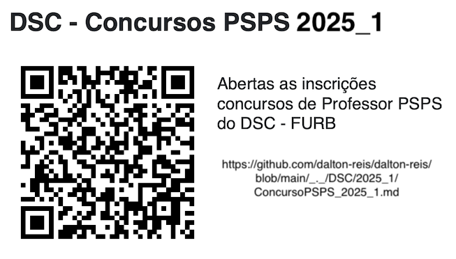

# DSC - Concursos PSPS 2025_1

Estão abertas as inscrições para os concursos de Professor Universitário em Caráter Temporário (PSPS) do Departamento de Sistemas e Computação (DSC) da Universidade Regional de Blumenau (FURB).  

Qualquer dúvida, favor entrar em contato com o prof. Dalton Reis ([dalton@furb.br](mailto:dalton@furb.br)).  

<!-- ----

## Inscrições ABERTAS -->

----

## Concurso a ser realizado

### Área Temática: Programação de Computadores

Edital N° 076/2025  
As inscrições serão realizadas no período de 23 a 27 de junho de 2025.
Edital: <https://anexos.cdn.selecao.net.br/uploads/342/concursos/422/anexos/44920ce9-81d6-45bd-b744-12641561f661.pdf>  
Prova Didática: 09/07/2025 14h Sala S-432
Presidente:  Dalton Solano dos Reis  
Titular: Luciana Pereira de Araújo Kohler  
Titular: Miguel Alexandre Wisintainer  
**Quantidade de candidatos inscritos: 5**  
<!-- 1. Ricardo Voigt
2. Marcos Rogério Cardoso
não vem 3. Artur Ricardo Bizon
4. Gabriel Vieira
5. Nodji Vasconcelos Ferreira Junior -->

### Área Temática: Ciência da Computação

Edital N° 081/2025  
As inscrições serão realizadas no período de 23 a 27 de junho de 2025.
Edital: <https://anexos.cdn.selecao.net.br/uploads/342/concursos/422/anexos/1d5b7b1b-a88b-437d-9d3e-4020ad4999fa.pdf>  
Prova Didática: 10/07/2025 14h Sala S-432
Presidente: Joyce Martins  
Titular: Dalton Solano dos Reis  
Titular: Andreza Sartori  
**Quantidade de candidatos inscritos: 1**  

### Área Temática: Sistemas de informação

Edital N° 088/2025  
<!-- As inscrições serão realizadas no período de 30 de junho a 04 de julho de 2025.   -->
As inscrições serão realizadas no período de 01 a 07 de julho de 2025.  
Edital: <https://anexos.cdn.selecao.net.br/uploads/342/concursos/425/anexos/b90e74ad-3b30-446c-81f9-799d0a45919b.pdf>  
Prova Didática: 16/07/2025 14h Sala S-432  
Presidente: Everaldo Artur Grahl  
Titular: Francisco Adell Péricas  
Titular: Alexander Roberto Valdameri  
<!-- **Quantidade de candidatos inscritos: 0**   -->

### Área Temática: Redes de Computadores

Edital N° 085/2025  
As inscrições serão realizadas no período de 01 a 07 de julho de 2025.  
Edital: <https://anexos.cdn.selecao.net.br/uploads/342/concursos/425/anexos/9134d11e-69ac-4b16-9f0e-5437511e23c2.pdf>  
Prova Didática: 15/07/2025 14h Sala S-432
Presidente: Francisco Adell Péricas  
Titular: Aurélio Faustino Hoppe  
Titular: Everaldo Artur Grahl  
<!-- **Quantidade de candidatos inscritos: 1**   -->
<!-- Gabriel Castelani de Oliveira -->

  

<!-- ----

## Inscrições a serem abertas -->

<!-- ### Área Temática: Hardware

Edital N° 082/2025  
As inscrições serão realizadas no período de 23 a 27 de junho de 2025.
Edital: <https://anexos.cdn.selecao.net.br/uploads/342/concursos/422/anexos/66875d38-14b9-4203-ad5d-8c874fb1ccb9.pdf>  
**Quantidade de candidatos inscritos: 1**
**Inscrição não aprovada, por não contemplar a exigência da titulação** -->

<!-- ### Área Temática: Inteligência Artificial

Edital N° 074/2025  
As inscrições serão realizadas no período de 23 a 27 de junho de 2025.
Edital: <https://anexos.cdn.selecao.net.br/uploads/342/concursos/422/anexos/96b3484c-5ad2-487a-b027-68f3ee6d78f2.pdf>  
**Não teve candidatos inscritos** -->
<!-- **Quantidade de candidatos inscritos: 0**   -->
