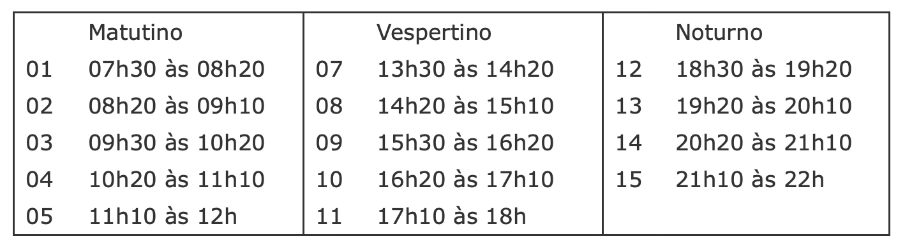
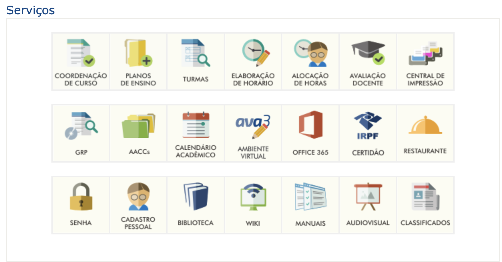
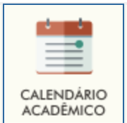
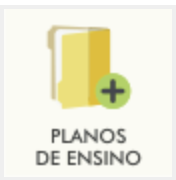
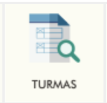
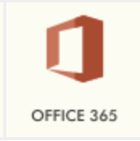

# Ingresso professor novo

  

## DSC - Departamento de Sistemas e Computação

[https://dsc.furb.br](https://dsc.furb.br)  
Sala: T-210  

## LCI - Laboratório de Computação e Informática

[https://dsc.furb.br/laboratórios](https://dsc.furb.br/laboratórios)  

Sala: S-407  

Funcionários:  
  Suporte técnico: Charles Bambinetti
  Suporte técnico: Dangelo de Moraes

-----  

## AVA3 - Ambiente Virtual de Aprendizado

[AVA3](https://www.furb.br/ava3)  
Ambiente custumizdo pela FURB que usa como base o Moodle.  
Bom para postar materiais e definir prazos para avaliações.  

-----  

## DION - Diário OnLine

[DION](https://www.furb.br/dion/)  
[Fechar Diário](Professor_DION_FecharDiario.pdf)  
Controle de frequências e notas.  

-----  

## FURB - Portal do Professor

Alguns serviços importantes para os professores.  
  

-----  

## FURB - Calendário

  

[Calendário Completo](https://www.furb.br/web/3468/servicos/calendarios/academico-graduacao/101/completo)  

-----  

## Planos de Ensino

  
[Planos](https://www.furb.br/planos)  
Submissão dos planos de ensino.  
-----  

## Turmas

  
[Turmas](https://www.furb.br/academico/uTurma)  
Consulta a lista de alunos e local das suas turmas.  

-----  

## MS Office 365

  

-----  
