# Monitores de Técnicas Básicas da Computação

<!--FIXME: Atualizar-->

## Henrique Delegrego  

hdelegrego@furb.br

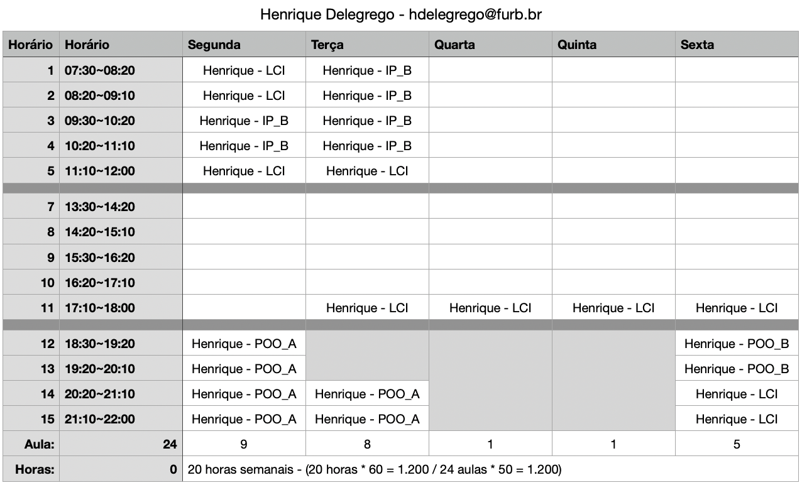  

## Julio Vicente Brych  

jbrych@furb.br  

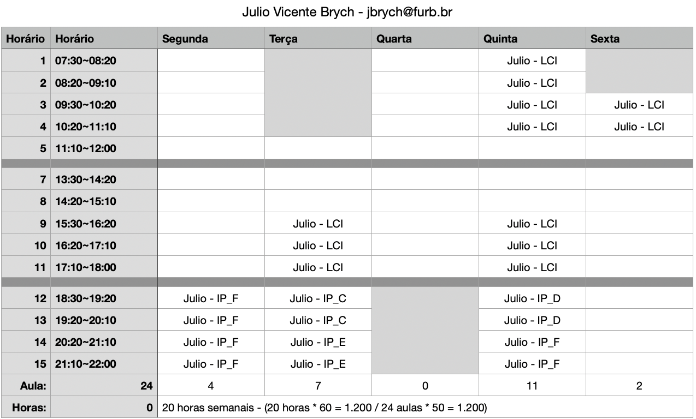  

## LCI - Laboratório de Computação e Informática

<https://www.furb.br/dsc/lci/>

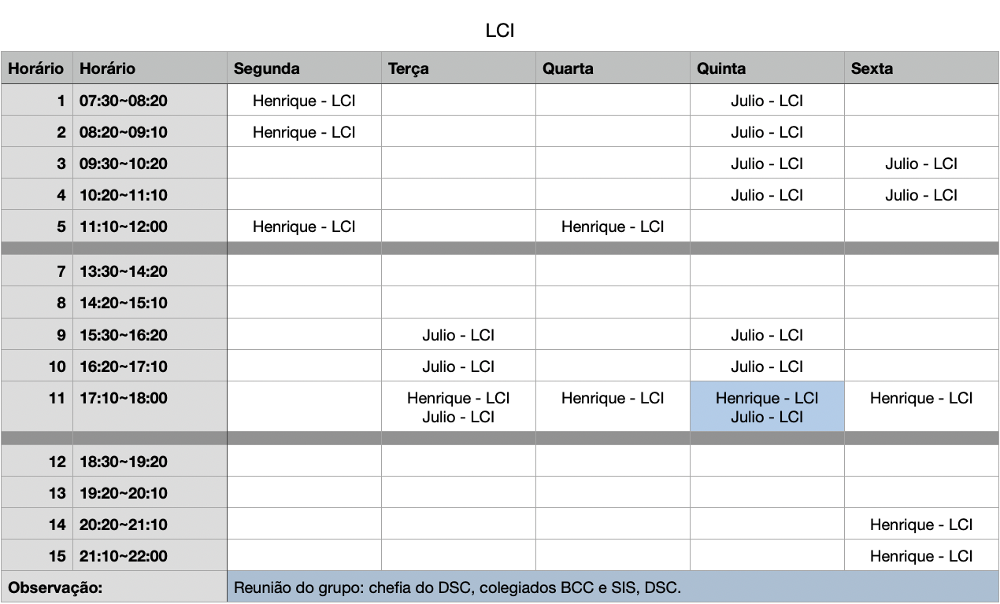

## Turmas - Introdução à Programação  

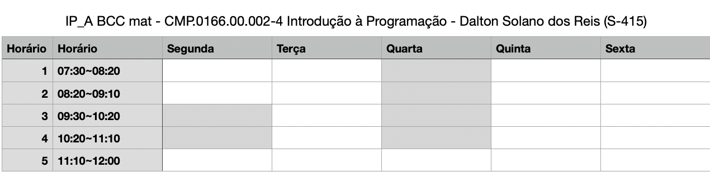  
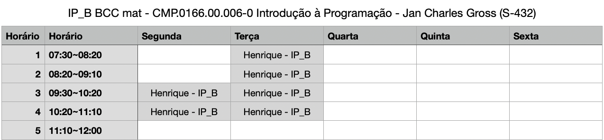  
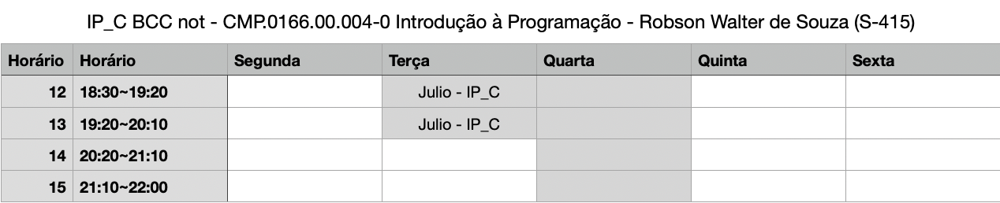  
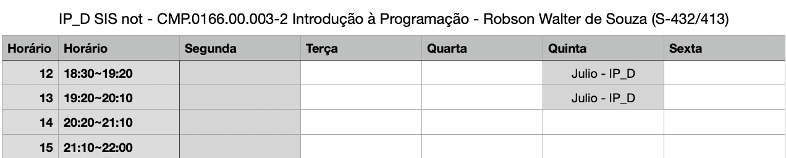  
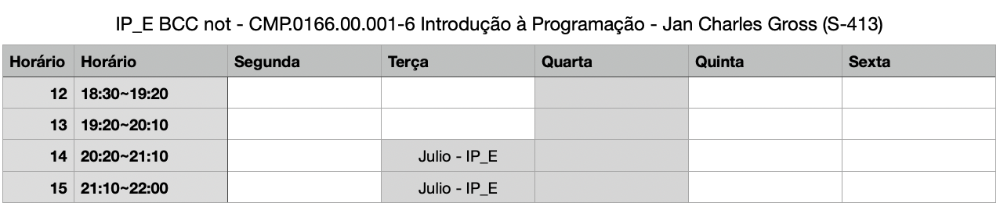  
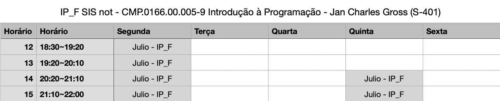  

## Turmas - Programação Orientada a Objetos  

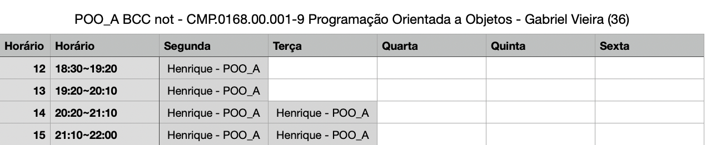  
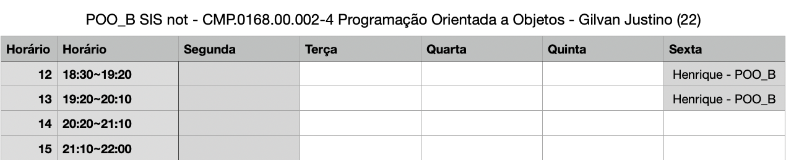  

## Turmas - Algoritmos e Estrutura de Dados  

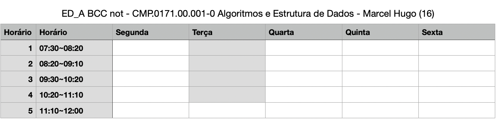  
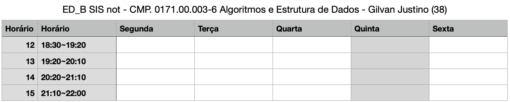  
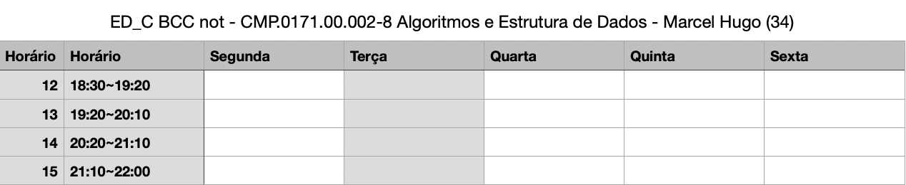  
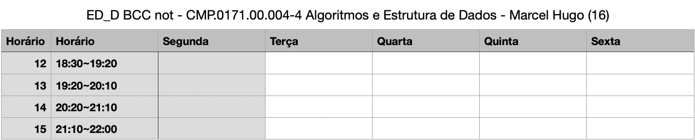  

<!--
## Julio Vicente Brych

Teams: jbrych@furb.br  

LCI (S-407)
LCI (S-407)

| horário     | segunda     | terça       | quarta      | quinta      | sexta       |
| ----------- | ----------- | ----------- | ----------- | ----------- | ----------- |
| 16:50-17:40 | LCI (S-407) |             | LCI (S-407) |             |             |
| 17:40-18:30 | LCI (S-407) |             | LCI (S-407) |             |             |
| 18:30-19:20 | POO (S-415) | IP  (S-415) | IP  (S-415) |             | LCI (S-407) |
| 19:20-20:10 | POO (S-415) | IP  (S-415) | IP  (S-415) |             | LCI (S-407) |
| 20:20-21:10 | POO (S-415) | POO (S-415) | IP  (S-415) |             | LCI (S-407) |
| 21:10-22:00 | POO (S-415) | POO (S-415) | IP  (S-415) |             | LCI (S-407) |
-->
<!--
**Atenção**: Para atendimento:
Informe sua turma  
  Printscreen do enunciado (se tiver)  
  Printscreen do que já foi desenvolvido  
Aguarde :)

**Dicas**:  

- Use o atalho: Tecla Windows + Shift + S para selecionar área e depois Ctrl + V para colar a *printscreen* na conversa com os monitores.  
- Mande mensagem fora do horário seguindo as instruções de atendimento e aguarde atendimento dentro dos horários, assim conseguimos atendê-los mais rápido!  
-->