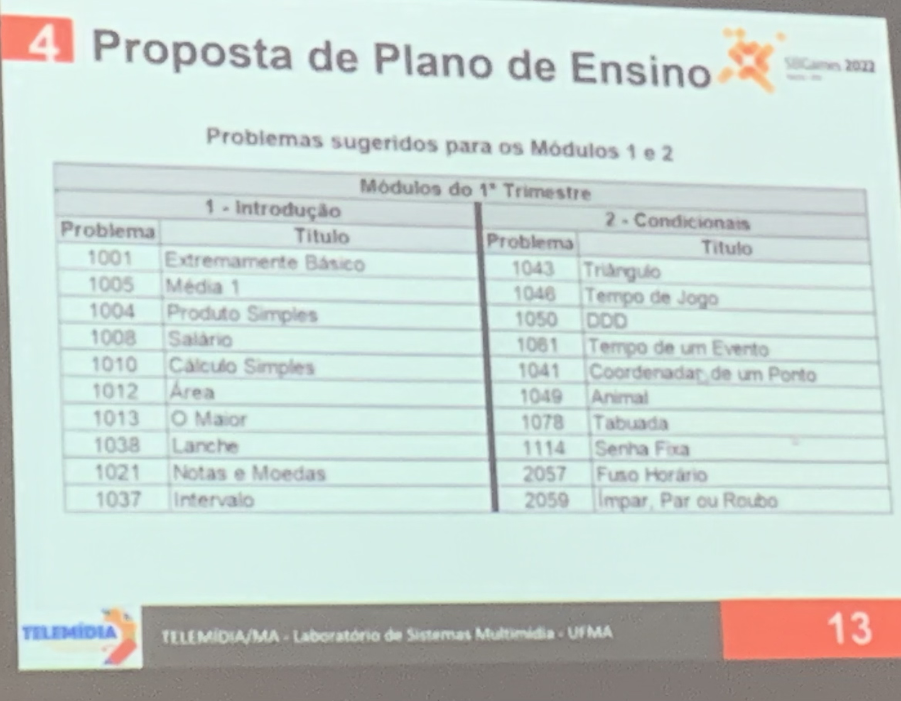

# Artigos

## 2022-10-24 - 10:01

[Tutoriais](../tutoriais/README.md "Tutoriais")  

## 2022-10-25 - 09:03 Educação ST-2  

Chair: Marcelo Luís Fardo  

### 226108 Ferramentas para o aprendizado de Linguagens Formais e Autômatos

Autores: José Luiz Mioni (UEL), Cinthyan Renata Barbosa (UEL – Universidade Estadual de Londrina)  

#### Ferramentas

[JFLAP](https://www.jflap.org "JFLAP")  

[Automaton Simulator](https://automatonsimulator.com "Automaton Simulator")  

[FSM Simulator](https://ivanzuzak.info/noam/webapps/fsm_simulator/ "FSM Simulator")  

[Finite State Machine Designer](https://madebyevan.com/fsm/ "Finite State Machine Designer")  
Gera parte visual em Lates  
Exporta em SVG  

### 226054 Metodologia para Capacitação Professores da Educação Básica baseada em Jogos, Gamificação e Pensamento Computacional

Autores: Fernando Degrandis (Colégio Marista Ipanema), Daniela Galante Ângelo Daniela, Felipi Wood, Roger Silva (Colégio Marista Ipanema), Isabel Cristina Silva (Universidade Federal de Ciências da Saúde de Porto Alegre – UFCSPA)  

Conteúdo ou Competência  
<https://www.matific.com/bra/pt-br/home/>

Formação continuada de professores  

Reconhecimento de Padrões  
Decomposição  
..  
..  
Jogo Boole -> processos de inferência  
Jigsaw <http://www.abed.org.br/congresso2017/trabalhos/pdf/402.pdf>  

### 226057 Cadê minha Pizza? Um jogo para exercitar Matemática e Pensamento Computacional através de grafos

Autores: Fernanda Pires (Universidade do Estado do Amazonas), Fabrizio Honda (Universidade do Estado do Amazonas), Jucimar Maia Silva Júnior (Universidade do Estado do Amazonas), Marcela Pessoa (Universidade do Estado do Amazonas)  

Pilares do Pensamento Computacional: decomposição, padrão, abstração e algoritmo  

Avaliação: MEGA+  
Utilizaram o FIGMA para gerar o protótipo  
Implementação: Unity
Game Learning Analytics - API
GLBoard (Melo, 2022)

[cademinhapizza.apk](cademinhapizza.apk "cademinhapizza.apk")  

### 226064 Jogos no Ensino de Linguagens Formais e Autômatos: Um Mapeamento Sistemático

Autores: Larissa Santini (UniCesumar), Maurilio Campano Junior (Universidade Estadual de Maringa), Alan Felinto (Universidade Estadual de Londrina), Linnyer Ruiz (UEM)  

Coletânea de resultados de análise sobre os jogos no SBGames.  

### 226067 Manna-X: Projeto, Desenvolvimento e Avaliação de um Jogo Multidisciplinar para Ensino na Ciência da Computação

Autores: Marcos de Assumpção (Universidade Estadual de Maringá), Maurilio Campano Junior ** (Universidade Estadual de Maringa), Alan Felinto (Universidade Estadual de Londrina), Linnyer Ruiz (UEM)  

- [Turing](#226065-turing-machine-game-simulator-um-jogo-educativo-para-ensino-de-máquina-de-turing)  

Circuitos Digitais e Arquitetura de Computadores  

Exemplos de jogos:

- Circuit Scramble  
- Planet K  
- Computasseia  

Desenvolvedor: Unity  
Avaliação: IAQJEd - Instrumento de Avaliação da Qualidade de Jogos Digitais com Finalidade Educativa (IAQJED)  
https:manna
Evolução da interface saindo de um modo caracter até o CG 3D
Evolução dos gráficos junto com a evolução do conteúdo (a história dos computadores)  

Futuro: RGB e outros modelos de cores, Pixel e Voxel, algoritmos clássicos de CG (Matrizes Transformação Geométricas) Personagem sair do PC (RA)  

### 226003 Gamificação como Ferramenta de Ensino Aprendizagem na Produção de Artefatos do CMMI

Autores: Euriam Barros de Araújo (Universidade Federal do Rio Grande do Norte), Jonathan Batista (Universidade Federal do Rio Grande do Norte), Joeldson Damasceno (Universidade Federal do Rio Grande do Norte), Charles Madeira (UFRN)  

[CMMI - Capability Maturity Model Integration](https://pt.wikipedia.org/wiki/CMMI "CMMI - Capability Maturity Model Integration")  

Elementos de gamificação na área de Engenharia de Software.  
Framework Octalysis  

## 2022-10-25 - 12:43 Educação ST-3  

### 225588 Matemagos: Uma Experiência de e-Sports e Matemática na Região Amazônica

Autores: Sylker Teles (Faculdades Fucapi), Isabelly Rohana Barbosa Oliveira** (UFAM), Suziane Cundiff (Universidade Federal do Amazonas), Brendo Balieiro (Flying Saci), Rodrigo Rosas (Dx Gameworks), TARCINAouRA Tavares (Secretaria de Educação e Desporto-SEDUC)  

- Pesquisa do DR  
- Protótipo  

### 226065 Turing Machine Game Simulator: Um Jogo Educativo para Ensino de Máquina de Turing

Autores: Guilherme Henrique Santana (Centro Universitário UniCesumar), Maurilio Campano Junior ** (Universidade Estadual de Maringa), Alan Felinto (Universidade Estadual de Londrina), Linnyer Ruiz (UEM)  

- Máquina de Turing  
- Fábrica de brinquedos  
- Jogo em 3D, mas sem textura  

- [Manna-X](#226067-manna-x-projeto-desenvolvimento-e-avaliação-de-um-jogo-multidisciplinar-para-ensino-na-ciência-da-computação)  

### 226112 Dominó Monetário: Um Jogo de Educação Financeira

Autores:  Helyane Borges (Universidade Tecnológica Federal do Parana), Simone Matos (UTFPR), Isabel Torrens (Universidade Tecnológica Federal do Paraná), Heloi Neto (Federal University of Technology Paraná), Henrique Boldrin (UTFPR), Luis Eduardo Oliveira (Universidade Federal do Paraná – Ponta Grosa)  

- IA aplicada - como os jogadores estavam jogando  
  - Algoritmo Guloso: Fácil  
  - Algoritmo A*: Difícil  
- HTML, CSS, JavaScript e Rect  

### 226143 Um jogo para auxiliar na aprendizagem de química orgânica

Autores: João Vitor de Souza Chagas (Universidade Federal Fluminense (UFF)), Aura Conci (UFF), Gleber Teixeira (Petrobras), Matheus Leal Ribeiro (Universidade Federal Rural do Rio de Janeiro)  

- [tcc_LeonardoRovigo](https://github.com/gcgfurb/tcc_LeonardoRovigo "tcc_LeonardoRovigo")  
  - [Vídeos](https://github.com/gcgfurb/tcc_LeonardoRovigo/tree/main/Arquivos/TCC/V%C3%ADdeos "Vídeos")  
- [PyMol](https://pymol.org/2/ "PyMol"): PyMOL é um software de computador, um sistema de visualização molecular criado por Warren Lyford DeLano.  

### 226070 Uma Revisão Sistemática da Literatura nos Anais do SBGames (2010 – 2022) com Jogos Digitais Educacionais em Química

Autores: Ayrton Matheus da Silva Nascimento (Universidade Federal Rural de Pernambuco), Bruno Leite (Universidade Federal Rural de Pernambuco)  

- Natureza Exploratória  
- Teoria de aprendizagem  

### 225393 Nova era da arte do ensino de saúde, da medicina e de suas práticas: aplicações do metaverso

Autores: Lúcia Lemos (Pontifícia Universidade Católica de São Paulo)  

- Ano 1992  
- Meta = além + universo  
- Axie Infinity: criaturas axies que batalham umas com outras, jogo base de turnos.  
- Cryptovoxels: eventos sociais, desfile de modas.  
- Decentraland: torneio de tênis, replica de redes e lojas.  

- Roblox (2006): Carolina Errera desfile.  
- The SandBox: vendas de lotes de terras virtuais.  
- Somnium Space:  
- Star Atlas:  

#### Saúde

- Telemedicina  
- Cirurgia com RA e Tec. 3D  
- TelementoriaL Uconn Health  
- Accuveil  
- Brain Lab  
- Ensino Medicina  

## 2022-10-25 - 16:07 Educação ST-5

### 225460 Codeland: um jogo para o ensino de lógica de programação com Python

Autores: Ayrtton Lucas Silva (Instituto Federal da Paraíba), Gabriel Nascimento (IFPB – Campina Grande), Jhonatan Guilherme Oliveira Pereira (Instituto Federal de Educação, Ciência e Tecnologia da Paraíba – IFPB), Luiz Medeiros Neto(Instituto Federal da Paraíba), Maria Eduarda Araújo (IFPB), Victor Oliveira (Instituto Federal de Educação, Ciência e Tecnologia da Paraíba)  

- Robocode  
- Scool  
- Codeland  
- Formulário: Meega+  

### 225898 Utilização da Plataforma Beecrowd de Maratona de Programação como Estratégia para o Ensino de Algoritmos

Autores: Allan Beckman Soares da Cruz (Universidade Federal do Maranhão), Carlos Soares Neto (UFMA), Pamela Torres Maia Beckman da Cruz (Universidade Federal do Maranhão), Mario Teixeira (UFM )  

- achar formas mais novas de ensinar algoritmos  
- gamificação, aulas invertidas e maratona de programação  
- URI -> Beecrowd  
- Maratona: competições curtas e longas  
-   

### 226044 Uso de Jogos Sérios no Ensino de Lógica de Programação: uma revisão sistemática da literatura

Autores: Marlow Dickel (Faculdade de Tecnologia SENAI Santa Catarina), Avanilde Kemczinski (UDESC – Universidade do Estado de Santa Catarina), Marcelo da Silva Hounsell (UDESC – Universidade do Estado de Santa Catarina)  

- Tipos  
- Características  
- Métricas  
- publicação na SBGames e GIS  
- poucos artigos publicados  

### 226118 Minigames para o desenvolvimento do pensamento computacional

Autores: Luciana P. de Araújo Kohler (Universidade Regional de Blumenau (FURB)), Dalton Reis (FURB – Universidade Regional de Blumenau), Mauricio Lopes (Universidade Regional de Blumenau), Gabriel Jorge Utyama de Carvalho (Universidade Regional de Blumenau (FURB)), Umberto Oliveira de Araújo Neto Leonetti (Universidade Regional de Blumenau (FURB)), Leonardo Linhares Silva (Universidade Regional de Blumenau (FURB)), Felipe Augusto de Carvalho de Araujo (Universidade Regional de Blumenau (FURB)), Artur Ricardo Bizon (Universidade Federal do Paraná (UFPR))  

Trocar o "Ensinar" para outra cosia ... o Gabriel pegou o contato de alguém.  

### 226172 Hello Food: um jogo para praticar conceitos de algoritmos para iniciantes na computação

Autores: Jeniffer Macena (UEA), Fernanda Pires (Universidade do Estado do Amazonas), Rafaela Melo (Universidade do Estado do Amazonas), Marcela Pessoa (Universidade do Estado do Amazonas)  

- equilíbrio entre os elementos  
- Operação Lovelace  
- Doce Sort  
- Simulação Puzzle  
- Figma  
- "Qualquer um pode programar" (frase boa para o Furbot)  .. baseada no Ratatouille "Qualquer um pode cozinhar"  
- Avaliação emoti-SAM  
- Avaliação MEEGA+  
- Game Learning Analytics  
