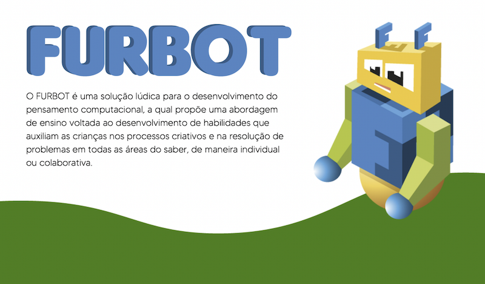
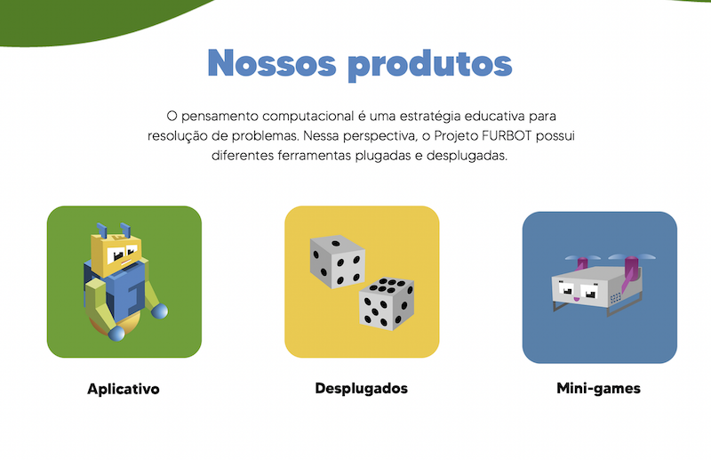
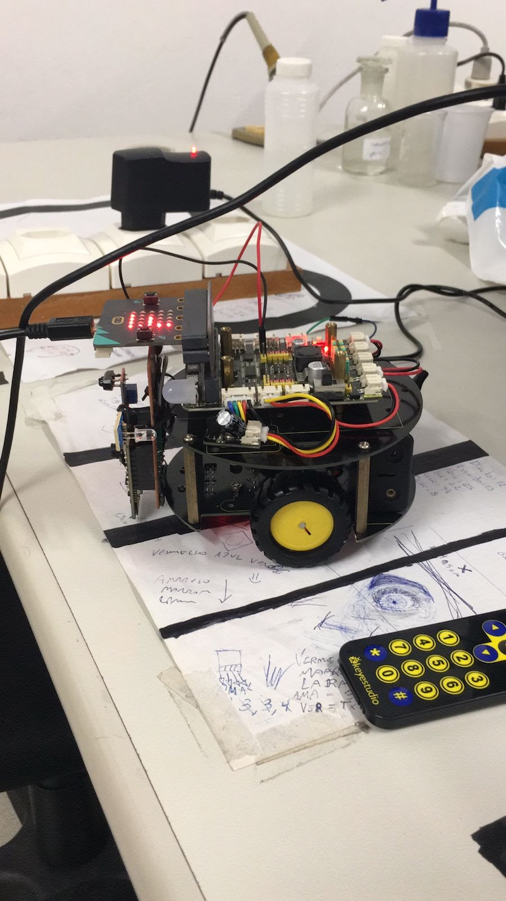

# Tabuleiro Humano do Furbot

## Festival de Jogos SBGames 2022 - Natal

Categoria: Analógicos (boardgames e cardgames)  

Universidade Regional de Blumenau (FURB)  
  

Desplugados
  

O jogo de tabuleiro humano é um dos jogos do projeto Furbot que tem como objetivo ensinar o Pensamento Computacional de forma atrativa e lúdica. Neste jogo, os jogadores são os "peões" do tabuleiro e, por meio de regras definidas, devem sair de sua origem, enfrentar obstáculos encontrados pelo caminho e concluir sua missão conforme o seu papel de jogador. O tabuleiro é produzido em lona e pode ser utilizado para diversos jogos, sendo que neste vídeo é apresentada uma das formas de jogá-lo com 5 jogadores envolvidos.

### Links

Formulário para Feedback: <https://forms.gle/zE1wBfRoDjJ2nWAT7>

Download do jogo: <https://drive.google.com/file/d/1OBoO3hJyaCGf0Rhi1bNMivmUVG1xIRte/view?usp=sharing>

Manual: [ManualTapete](ManualTapete.pdf "ManualTapete")  

Video de gameplay: <https://youtu.be/8wKNg2-IDxY>

Video trailer: <https://youtu.be/Pf9el523NuQ>

### Futuro

Integração com o robô físico no tabuleiro com o jogo virtual.  
  

### Site

FURBOT - <www.furb.br/furbot>  
  
