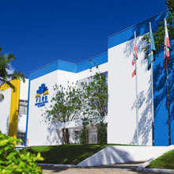
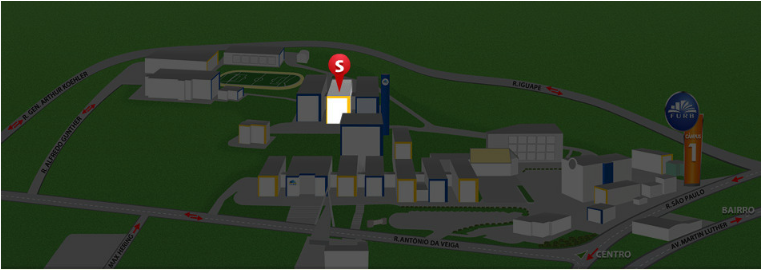
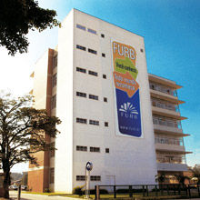
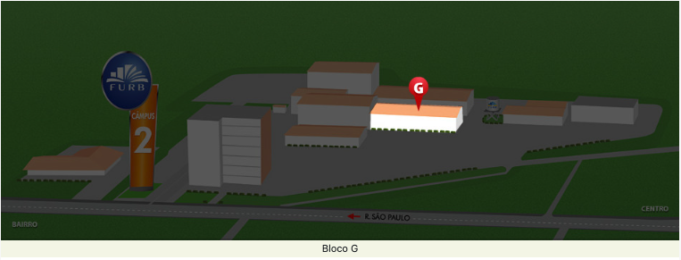

# Curso do Entra21

## Coordenador pedagógico

prof. [Dalton Solano dos Reis](https://github.com/dalton-reis/dalton-reis "Dalton Solano dos Reis")  
Informações: (47) 99101-2777 (WhatsApp)

## Turma vespertino

### Localização

    FURB - câmpus 1 - Central  
    Rua Antônio da Veiga, 140  
    Blumenau - SC  
  

  Bloco S - laboratório S-429  
  

  [Google Maps](https://www.google.com/maps/place/Funda%C3%A7%C3%A3o+Universidade+Regional+de+Blumenau+-+FURB/@-26.9057073,-49.0790221,17z/data=!3m1!4b1!4m6!3m5!1s0x94df1f2b4ebc711b:0xca47c4b02338db14!8m2!3d-26.9057073!4d-49.0790221!16s%2Fg%2F124spxss3?entry=ttu "Google Maps")  

## Turma noturno

    FURB - câmpus 2  
    Rua São Paulo, 3250  
    Blumenau - SC    
  

  Bloco G - laboratório 011  
  

  [Google Maps](https://www.google.com/maps?cid=1363094366434644461&_ga=2.147400183.1369559237.1542710343-1088331020.1542710343 "Google Maps")  
