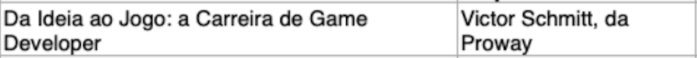
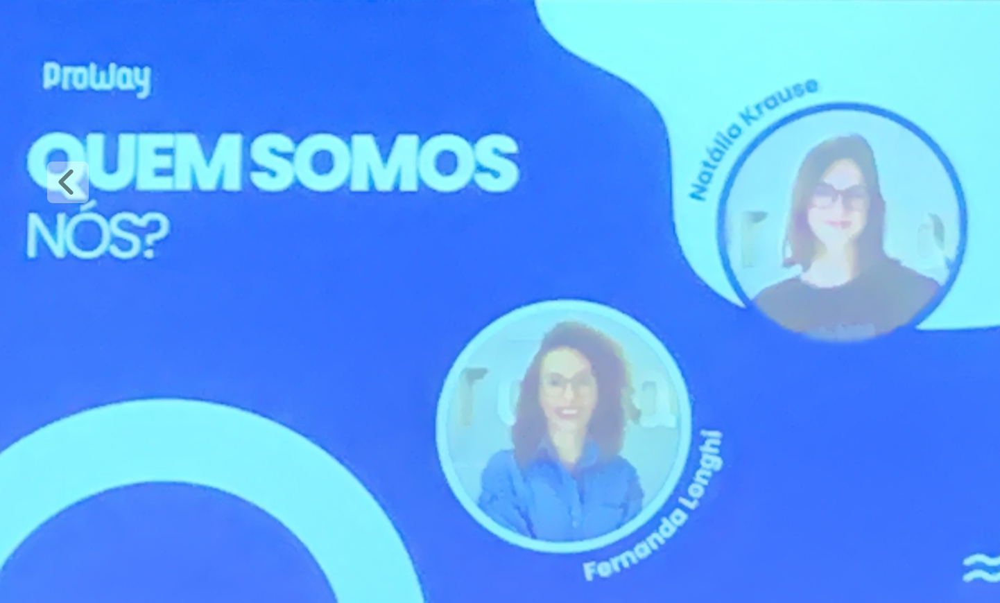

# Palestra Jogos

  
  

GDD <https://chatgpt.com/c/68114a3e-2e54-8008-90d4-1417c65fb094>  

## Game Designer

## Game Developer

## Artista

## Técnico de Audio

O audio "prende" mais do que o visual. Hoje se tem muito de vídeo (muito realista), mas ainda se tem muito para fazer em audio.  

HavOk <https://chatgpt.com/c/68114a3e-2e54-8008-90d4-1417c65fb094>  

GoDot <https://chatgpt.com/c/68114a3e-2e54-8008-90d4-1417c65fb094>  

AbraGames  

Marco Legal: deixou de ser jogo de azar para serem produções audio-visuais.  
Lei Rouanet
Será que poderia ter algo para o desenvolvimento do FURBOT?  

<https://chatgpt.com/share/68114f2e-bbc0-8008-8f58-6fed42e10a67>

Uma vantagem de usar UnReal no lugar da Unity é que se tem taxas menores para venda de jogos. Senão vender não se peder dinheiro.  
