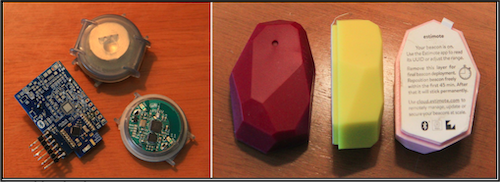
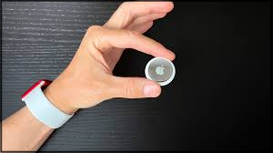

# Realidade Virtual Alternativa (RAl)  

Combinação de situações do virtual com o real.

Alguns pontos que devem ser observados:  

- transforma o [mundo real](../README.md#mundo-real "mundo real") em um cenário para a [interação](../README.md#interação "interação") do usuário;  
- incentiva que os usuários se "movimentem" no [mundo real](../README.md#mundo-real "mundo real") para interagir com os objetos virtuais no [mundo real](../README.md#mundo-real "mundo real").  

##### RAl - Exemplos

Um exemplo é o Pokemon Go que uns tempos atrás se torno uma "febre" onde se via pessoas explorando o [mundo real](../README.md#mundo-real "mundo real") em busca de "recompensas" do [mundo virtual](../README.md#mundo-virtual "mundo virtual"). A RAl pode promover além do entretenimento, outras funcionalidades, por exemplo, "construir algo" com o apoio do coletivo (gratuito). Um exemplo desta "construção" coletiva são as estatísticas de transito no Aplicativo de navegação [Waze](https://pt.wikipedia.org/wiki/Waze "Waze").  

- [Pokemon GO - Pokéball Plus](<https://www.youtube.com/watch?v=3UWnEo3A5fU> "Pokemon GO - Pokéball Plus")  

## RAl - Hardwares

Beacons - iBeacons  
  

  
