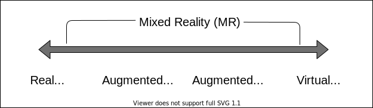

# Realidade Virtual Misturada (RM)  

Mistura do virtual com real, e o real com o virtual, nos dois "sentidos".  

Alguns pontos que devem ser observados:  

- combina cenas do [mundo real](../README.md#mundo-real "mundo real") com o [mundo virtual](../README.md#mundo-virtual "mundo virtual"), e do virtual com o real;  
- permite [interação](../README.md#interação "interação") nos "dois" sentidos;  
- união de realidade aumentada e realidade virtual.  

Dependendo do cenário a ser aplicada a RM pode usar ("misturar") todas as outras Realidades Virtuais juntas.  

  

A “misturara” geralmente é de imagens, mas pode ser de áudio, so informação, outros sentidos .. tato -> IUT

Para se pensar ...

    "A realidade misturada é o próximo ciclo na computação, seguida por mainframes, PCs e smartphones."  

## RM - Exemplos

Material da Microsoft promovendo o uso do Hololens - Corpo Humano.  
  

")
