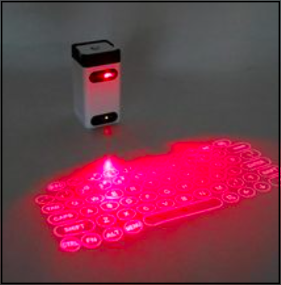
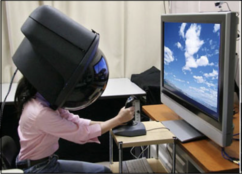
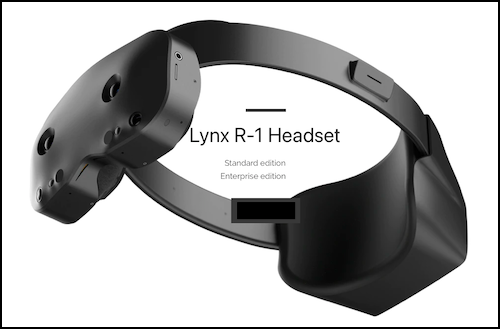
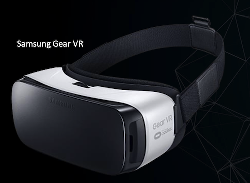
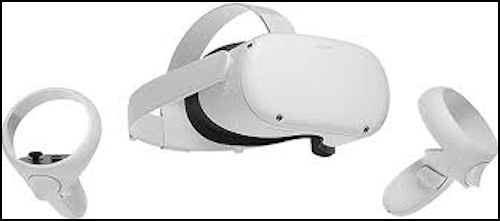
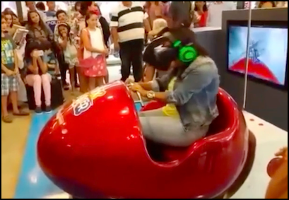

# Interação ETEVI - 2023

## Da Realidade Virtual ao Metaverso: o que já fizemos e para onde vamos

   
        Nome: Dalton Solano dos Reis  
        Contato: dalton@furb.br  

## Inquietações

Pensei em algumas perguntas para tentarmos responder  

- Será que Realidade Virtual é algo novo?  
- Eu já usei algo de Realidade Virtual?  
- Eu sei o que é Realidade Virtual?  
- Qual a diferença entre Realidade Virtual e Metaverso? Hum, será que Metaverso é a palavra da "moda".  
- Onde se pode usar Realidade Virtual?  
- Realidade Virtual veio para ficar, ou é apenas uma "modinha" passageira?  
- e outras perguntas de vocês no final da apresentação ... assim espero 😁  

## Agenda

- Quem sou eu: [https://github.com/dalton-reis/dalton-reis](https://github.com/dalton-reis/dalton-reis "https://github.com/dalton-reisdalton-reis/")  
- Termos  
- Linha do Tempo  
- Tipos de Realidades Virtuais
- Para saber mais
- Mais Exemplos  
- Perguntas  

## Conceitos

Antes dos conceitos sobre Realidade Virtual voltamos por um momento a uma das perguntas iniciais ...  

    Eu já usei algo de Realidade Virtual?  

Exemplo sensor de ré do carro com projeção de percurso virtual  

Ponto de ônibus com Realidade Virtual  
  

### Termos

Alguns [termos](#termos "termos") importantes para área da Realidade Virtual.  

#### Imersão

Sentimento de estar-se dentro do ambiente.  

#### Interação

Está ligada com a capacidade do computador detectar as entradas do usuário e modificar “instantaneamente” o [mundo virtual](#mundo-virtual "mundo virtual") e as ações sobre ele. Se busca por formas mais "naturais" de [Interação](#interação "Interação") para maximizar a [Imersão](#imersão "Imersão").  

Teclado Virtual - Alternativas de [Interação](#interação "Interação") usando formas tradicionais  
  

Teclado Virtual (ao vivo 😅)  

LeapMotion - Alternativas de [Interação](#interação "Interação") usando formas **não** tradicionais  
  

LeapMotion - Explorando objetos virtuais: "descascador" de gatos  
  

Alguns Trabalhos nossos usando LeapMotion  
 ( 📢 )  

#### Envolvimento

Tange ao grau de motivação para conectar ("ligar") a pessoa com uma determinada atividade.  

#### Mundo Real

Mundo físico onde vivemos.  

#### Mundo Virtual

Mundo modelado virtualmente por modelos de computação gráfica que podem simular o [mundo real](#mundo-real "mundo real").  

#### Ancora RA

Forma de ancorar ("grudar") um objeto virtual ([mundo virtual](#mundo-virtual "mundo virtual")) em um objeto real ([mundo real](#mundo-real "mundo real")).  

### Linha do Tempo

Alguns pontos marcantes na história da Realidade Virtual: Sensorama, Helmet e Ivan Sutherland.  

**Sensorama** - espécie de cabine, que combinava filmes 3D, som estéreo, vibrações mecânicas, aromas, e ar movimentado por ventiladores. Patenteado em **1962** por Morton Heilig, o Sensorama já utilizava-se de um dispositivo para visão estereoscópica.  
  

Primeiro capacete de Realidade Virtual (Head Mounted Display - HMD) **Helmet** was made in **1967**.  
  

Sistema criado por **Ivan Sutherland** no ano de 1968, como o objetivo de adicionar informações virtuais sobre os objetos reais, facilitando as tarefas do dia a dia. Como outras tecnologias a Realidade Aumentada também teve um grande incentivo financeiro das Forças Armadas dos Estados Unidos da América (EUA), o estudo tinha foco na geração de informações gráficas interativas, assim como de imagens mais realistas e melhores sistemas de rastreamento (_tracking_).  
  

Equipamento para Visão Estereoscópica usado no Brasil na época colonial no **museu de Curitiba - PR**.  
  

O conceito da **Realidade Aumentada** de sobreposição de objetos virtuais em objetos reais trazendo mais informações veio somente nos anos 90. No ano de 1993, foi criado o primeiro sistema móvel de Realidade Aumentada para ambientes externos utilizando as coordenadas do Sistema de Posicionamento Global (Global Positioning System - GPS) pelos pesquisadores da Universidade da Califórnia, para servir como assistente de navegação para deficientes visuais, colocando voz à imagem captada.

### Tipos de Realidades Virtuais

Uma forma de conceituar o que é Realidade Virtual e entender os tipos de realidades.

  

#### Realidade Virtual Imersiva (RV / RVi)

A RV pode ser classificada conforme o nível de [interação](#interação "interação") do usuário com o sistema de RV, em **imersiva** e **não-imersiva**. É **imersiva** quando o usuário é transportado para o domínio da aplicação de RV, com a utilização de ferramentas que auxiliem na [imersão](#imersão "imersão"), como, por exemplo, capacete e luva para simulação de visão e tato, auxiliando a sensação de estar dentro de um [mundo virtual](#mundo-virtual "mundo virtual"). E é **não-imersiva** quando o usuário é transportado para o domínio da aplicação parcialmente, interagindo com um [mundo virtual](#mundo-virtual "mundo virtual") sem fazer parte dele, como, por exemplo, a utilização de monitor e projeção.  

Alguns pontos que devem ser observados para aumentar a [imersão](#imersão "imersão"):

- representar do [mundo virtual](#mundo-virtual "mundo virtual") que permita a [imersão](#imersão "imersão") do usuário (quanto mais crível melhor);  
- controlar os “sentidos” proporciona [imersão](#imersão "imersão") (mais comum: visão e tato);  
- poder interagir ou não com o que vê ao seu redor.

A Realidade Virtual Imersiva (RVi) procura trazer o usuário da aplicação para o ambiente virtual, já a Realidade Aumentada (RA), mantém o usuário no seu ambiente físico e transporta o ambiente virtual para o espaço do usuário, permitindo a [interação](#interação "interação") com o [mundo virtual](#mundo-virtual "mundo virtual"), de maneira mais natural e sem necessidade de treinamento ou adaptação.  

Uma aplicação de RVi também é RV, mas uma aplicação de RV não é RVi.  

##### RVi - Hardwares

De uma forma geral, independente de qual tipo de Realidade Virtual se pretende usar é interessante pensar como o hardware pode proporcionar entrada, processamento e saída.  
Alguns exemplos de equipamentos usados em RVi.  

##### Data Gloves - Luvas

Conhecidas como Luvas de Dados etc. Permite rastrear os movimentos das mãos e ter a sensação de tato. O LeapMotion não da retorno de tato.  

  

##### Head-Mounted Display - Capacetes

Conhecidos como óculos virtuais, cardboard etc.  

  
  
  
  
  
  
  
  

  

Uso do Oculus Quest 2 por professores da FURB.  
  

Uso do Oculus Quest 2 por professores da FURB - vídeo completo.  
[HMD_Habitat_2021_2](_/Conceitos/HMD_Habitat_2021_2.mp4 "HMD_Habitat_2021_2")  

Uso do Oculus Quest 2 por professores da FURB - TCCs.  
[2021 - Gabriel Garcia Salvador](https://github.com/gcgfurb/tcc_GabrielGarciaSalvador/blob/master/Textos/tcc_bcc_2021_1_gabrielgarcia_gabrielgarciasalvador-VF.pdf "2021 - Gabriel Garcia Salvador")  
[2021 - Leonardo Rovigo](https://github.com/gcgfurb/tcc_LeonardoRovigo/blob/main/Textos/tcc_bcc_2021_1_lrovigo_LeonardoRovigo-VF.pdf "2021 - Leonardo Rovigo")  

##### SmartPhones e outros

Uma das grande limitações atuais é gerar espaços virtuais ([Mundo Virtual](#mundo-virtual) "Mundo Virtual") para ser usado na área da Realidade Virtual.  

Braçadeira Myo  
  

##### RVi - Exemplos

Um exemplo de uso de RV é um usuário utilizando uma ferramenta de modelagem 3D (ex. Sketchup), e de RVi é quando o usuário coloca um HMD que "fecha" todo campo de visão do usuário, ou até mesmo "controlando" outros sentidos, e assim aumentando a [imersão](#imersão "imersão") deste usuário.  

A RVi explora o uso HMD para "controlar" o campo de visão do usuário ( 📢 ).  

 ( 📢 )  

Quanto mais controle dos sentidos, mais imersão, então se explora o uso de equipamentos para dar um retorno de Tato.  

  

#### Realidade Virtual Aumentada (RA)  

Uma aplicação de RA também é RV, mas uma aplicação de RV não é RA. Pois as aplicações que usam RA devem ter três características: combinar real com virtual, ter [interação](#interação "interação") em "tempo real" e usar o espaço 3D.  

Alguns pontos que devem ser observados:

- mistura do virtual com real;  
- único sentido: do virtual para real ou real para virtual (mais comum);  
- necessidade de marcadores (âncoras) no [mundo real](#mundo-real "mundo real").  

##### RA - Exemplos

Rótulos de Garrafas  
 ( 📢 )  

Mesa Tátil da TV Globo  
  

Painel de Fotos com Jogadores  
 ( 📢 )  

FolhAR - Explorando Folhas de Plantas com Realidade Aumentada  
  
[2021 - Bruno Geiser Vigentas](https://github.com/gcgfurb/tcc_BrunoGeislerVigentas/blob/main/Textos/tcc_bcc_2021_1_bvigentas_BrunoGeiserVigentas-VF.pdf "2021 - Bruno Geiser Vigentas")  

Caixa E-Água - Caixa de Areia Interativa

[http://caixae-agua.blogspot.com/p/projeto-nome-da-capes-adiconar.html](http://caixae-agua.blogspot.com/p/projeto-nome-da-capes-adiconar.html "http://caixae-agua.blogspot.com/p/projeto-nome-da-capes-adiconar.html")  

[LCC - SARndbox](https://www10.furb.br/manuais/manual-caixa-de-areia.php "LCC - SARndbox")  
Projeto realizado com base nos projetos Caixa E-Água e da University of California.  

Algumas momentos da Caixa E-Água

  
  

[Mais da Caixa E-Água](_/CaixaEAgua "Mais da Caixa E-Água")  

[Home Design](https://apps.apple.com/br/app/home-design-3d/id463768717https://apps.apple.com/br/app/home-design-3d/id463768717 "Home Design") (ao vivo 😅)  

FES - Sistema Solar (ao vivo 😅)  

[2017 - Evandro Matheus Schmitz](https://www.furb.br/dsc/arquivos/tccs/monografias/2017_1_evandro-matheus_monografia.pdf "2017 - Evandro Matheus Schmitz")  

##### RA - Hardwares

Google Glass  
  

[Novo Google Glass](https://olhardigital.com.br/2019/05/20/noticias/google-anuncia-oculos-de-realidade-aumentada-com-visual-mais-comum/ "Novo Google Glass")  

[LIDAR - LIght Detection And Ranging](https://pt.wikipedia.org/wiki/Lidar "LIDAR - LIght Detection And Ranging")  

[2021 - Bruno Henrique de Borba](https://github.com/gcgfurb/tcc_BrunoHenriqueBorba/blob/main/tcc_bcc_2021_2_bhborba_BrunoHenriqueDeBorba/Textos/tcc_bcc_2021_2_bhborba_BrunoHenriqueDeBorba-VF.pdf "2021 - Bruno Henrique de Borba")  
 ( 📢 )  

[Qualcomm Snapdragon XR2 5G Platform - Local](_/Conceitos/HMD_QualcommSnapdragonXR25G.mov "Qualcomm Snapdragon XR2 5G Platform - Local")  
[Qualcomm Snapdragon XR2 5G Platform](https://www.youtube.com/watch?v=b_MMypnh_AI "Qualcomm Snapdragon XR2 5G Platform")  

#### Realidade Virtual Diminuída (RD)  

Uma aplicação de RD também é RV, mas uma aplicação de RV não é RD. Nas aplicações de RD o principal objetivo é "Esconder" objetos no [mundo real](#mundo-real "mundo real") usando objetos do [mundo virtual](#mundo-virtual "mundo virtual").  

Alguns pontos que devem ser observados com a RD:

- utilizado normalmente em produções de vídeo/imagens, onde elementos não desejáveis precisam ser removidos;  
- pode permitir que o usuário remova objetos de vídeos em tempo real;  
- pode ser utilizado em conjunto com a realidade aumentada, para proporcionar uma
experiência de [imersão](#imersão "imersão") maior;  

##### RD - Exemplos

Remoção de objetos com um fundo complexo - [Chroma Key](https://pt.wikipedia.org/wiki/Chroma_key "Chroma Key") sem ter um fundo de cor fixa (ambiente estruturado).  
  

Remoção de objetos usando tablet em ambiente não estruturado.  
  

Remoção de objetos com seleção de região ([Region Of Interest - ROI](https://en.wikipedia.org/wiki/Region_of_interest "Region Of Interest - ROI")) em ambiente não estruturado.  
  

#### Realidade Virtual Misturada (RM)  

Mistura do virtual com real, e o real com o virtual, nos dois "sentidos".  

Alguns pontos que devem ser observados:  

- combina cenas do [mundo real](#mundo-real "mundo real") com o [mundo virtual](#mundo-virtual "mundo virtual"), e do virtual com o real;  
- permite [interação](#interação "interação") nos "dois" sentidos;  
- união de realidade aumentada e realidade virtual.  

Dependendo do cenário a ser aplicada a RM pode usar ("misturar") todas as outras Realidades Virtuais juntas.  

  

A “misturara” geralmente é de imagens, mas pode ser de áudio, so informação, outros sentidos .. tato -> IUT

Para se pensar ...

    "A realidade misturada é o próximo ciclo na computação, seguida por mainframes, PCs e smartphones."  

##### RM - Exemplos

Material da Microsoft promovendo o uso do Hololens - Corpo Humano.  
  

")

#### Realidade Virtual Alternativa (RAl)  

Combinação de situações do virtual com o real.

Alguns pontos que devem ser observados:  

- transforma o [mundo real](#mundo-real "mundo real") em um cenário para a [interação](#interação "interação") do usuário;  
- incentiva que os usuários se "movimentem" no [mundo real](#mundo-real "mundo real") para interagir com os objetos virtuais no [mundo real](#mundo-real "mundo real").  

##### RAl - Exemplos

Um exemplo é o Pokemon Go que uns tempos atrás se torno uma "febre" onde se via pessoas explorando o [mundo real](#mundo-real "mundo real") em busca de "recompensas" do [mundo virtual](#mundo-virtual "mundo virtual"). A RAl pode promover além do entretenimento, outras funcionalidades, por exemplo, "construir algo" com o apoio do coletivo (gratuito). Um exemplo desta "construção" coletiva são as estatísticas de transito no Aplicativo de navegação [Waze](https://pt.wikipedia.org/wiki/Waze "Waze").  

- [Pokemon GO - Pokéball Plus](<https://www.youtube.com/watch?v=3UWnEo3A5fU> "Pokemon GO - Pokéball Plus")  

##### RAl - Hardwares

Beacons - iBeacons  
  

  

#### Metaverso  

Metaverso é a terminologia utilizada para indicar um tipo de [mundo virtual](#mundo-virtual "mundo virtual") que tenta replicar a realidade através de dispositivos digitais. É um espaço coletivo e virtual compartilhado, constituído pela soma de "realidade virtual", "realidade aumentada" e "Internet". Este termo foi utilizado pela **primeira vez em 1992**, e exemplos mais recentes são os jogos [VRChat](https://en.wikipedia.org/wiki/VRChat "VRChat"), [Second Life](https://pt.wikipedia.org/wiki/Second_Life "Second Life"), [Roblox](https://pt.wikipedia.org/wiki/Roblox "Roblox"), [Fortnite](https://pt.wikipedia.org/wiki/Fortnite "Fortnite"), [Facebook Meta](https://about.facebook.com/br/meta/ "Facebook Meta"), entre outros. Mais recente, aquisição da [AltVR Space](https://altvr.com "AltVR Space") pela Microsoft.  

[Second Life](https://pt.wikipedia.org/wiki/Second_Life "Second Life") é um **jogo de 2003** criado pela Linden Lab. O propósito do [Second Life](https://pt.wikipedia.org/wiki/Second_Life "Second Life") era de criar uma realidade paralela onde usuários poderiam jogar, socializar, trabalhar, comprar e vender propriedades, entre outras atividades. Houve muito interesse nos primeiros anos do jogo, com cobertura jornalística do Estadão no jogo, exposições do Itaú Cultural e apresentação de bandas.  

Acreditando que o Metaverso é o futuro da internet e tecnologia, Mark Zuckerberg, CEO do Facebook, **mudou em 2021** o nome de sua empresa para Meta Platforms Inc, ou Meta. Ele diz que a empresa irá abranger tudo o que eles acreditam, focando na construção do Metaverso. Bem como, outras grandes empresas seguem a mesma tendência. Por exemplo, a Apple ao anunciar o "SharePlay" na opção "Assistir Juntos", que permite ver filmes e séries nas chamadas FaceTime com seus amigos, permitindo uma conexão interativa em tempo real enquanto assistem ao mesmo conteúdo. Bem antes da Facebook se transformar em Empresa Meta, a Microsoft, Google e Apple já estavam fazendo sua "lição de casa" para também entrar no mercado das Realidades Virtuais e Metaverso.  

Usando iPad em jogo de RA registrando um [mundo virtual](#mundo-virtual "mundo virtual") no [mundo real](#mundo-real "mundo real") (mesa) permitindo a [interação](#interação "interação") entre dois jogadores.  
 ( 📢 )  

Equipe brasileira faz a primeira simulação de cirurgia no Metaverso ([https://globoplay.globo.com/v/10807963/](https://globoplay.globo.com/v/10807963/ "https://globoplay.globo.com/v/10807963/")).  
[MV Cirurgia Avatar](_/Conceitos/MV_CirugiaAvatar.mov "MV Cirurgia Avatar").  

[Desfile de moda no Metaverso - Febratex](_/Conceitos/DesfileMetaversoModaFebratex.pdf "Desfile de moda no Metaverso - Febratex")  

##### Metaverso - Para saber mais

- 09/02/2022: Os Metaversos e a transformação das Instituições Educacionais  
  - [Apresentação](https://youtu.be/PkWr7KhD44Q "Apresentação")  
  - [Material](https://3af732ee-100e-4457-9aaf-d3efd60d40f3.usrfiles.com/ugd/3af732_210b882240434c72ad66e42a30b9f28e.pdf "Material")  

- 17/12/2021: [Onde Você Vai Viver e Trabalhar em Breve](<https://youtu.be/IqTC4lsxNfk> "Onde Você Vai Viver e Trabalhar em Breve")  

##### Críticas e preocupações

- Privacidade  
- Vício: transtorno do vício em Internet  
- 'fuga' da realidade  

##### Vantagens

Sem limites de distâncias, escala, tempo etc no mundo virtual.  

## Para saber mais

Principal evento Nacional sobre Realidade Virtual  

### 2020 - Symposium on Virtual and Augmented Reality - SVR

  Pre-Symposium (BR): <https://youtu.be/LU-LJUo6fyA>  
  Data: 07/11/2020  
  Formato: Remoto  
  Livro do Simpósio: [Introdução aos Conceitos de RV](_/ParaSaberMais/Conceitos-rv-ra.pdf "Introdução aos Conceitos de RV")  

#### 2022 - Symposium on Virtual and Augmented Reality - SVR

Eu fui 😁 ...  

  <http://www.natalnet.br/svr2022/>  
  Data: 24/10 a 27/10  
  Formato: presencial - Natal, RN  

## Mais Exemplos

[Mais Exemplos](_/MaisExemplos "Mais Exemplos")  

## Perguntas  

   
        Nome: Dalton Solano dos Reis  
        Contato: dalton@furb.br  
