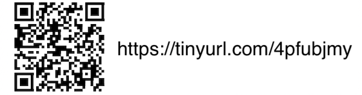
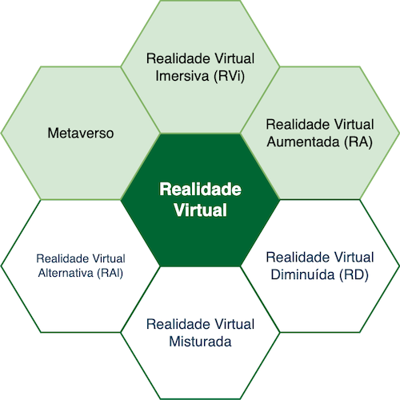
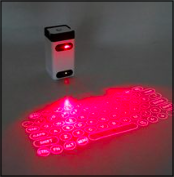
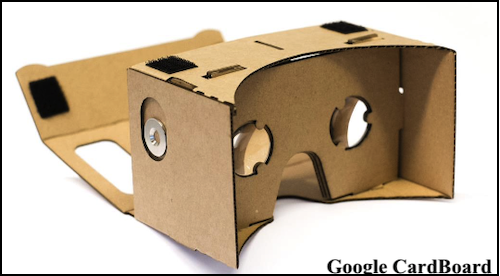
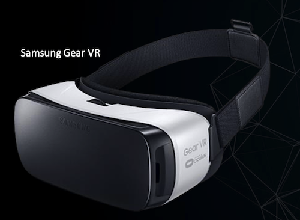
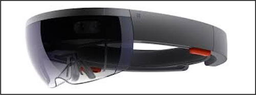
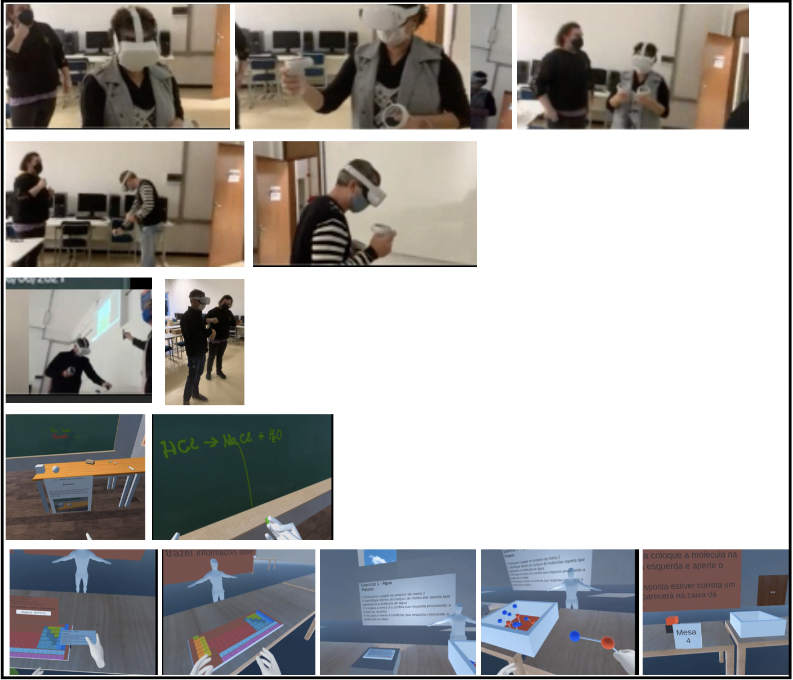
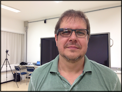
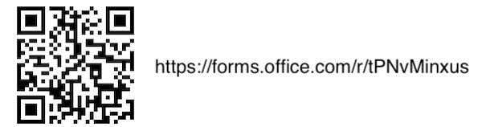

<!-- https://drive.google.com/file/d/1tLKy1e7P4M5k27MIGpBtK325xAj1JLUL/view -->  
<!-- Ambulância ramal: 499 e 199 -->  
<!-- interacao@furb.br -->  
<!-- WhatsApp: 99923-7955 -->  

<!-- Fazer:
 - está na rede cabeada?
 - o MacBook criou uma rede?
 - está projetando (HMDI/VGA)?
 - o iPhone está na mesma rede do MacBook
 - testar se funciona o compartilhamento de tela com iPhone?
 - Tocar música: https://music.apple.com/br/playlist/palestra/pl.u-ovdau0PMe0V?l=en
-->

# Interação FURB

  

    Da Realidade Virtual ao Metaverso: o que já fizemos e para onde vamos ...  
    
    Prof. Dalton Reis - Computação

## Agenda

- Quem sou eu: [https://github.com/dalton-reis/dalton-reis](https://github.com/dalton-reis/dalton-reis "https://github.com/dalton-reisdalton-reis/")  
- Linha do Tempo  
- Tipos de Realidades Virtuais e Metaverso  
- Material completa  
- Perguntas  

## Inquietações

Pensei em algumas perguntas para tentarmos responder  

- Será que Realidade Virtual é algo novo?  
- Eu já usei algo de Realidade Virtual?  
- Eu sei o que é Realidade Virtual?  
- Qual a diferença entre Realidade Virtual e Metaverso? Hum, será que Metaverso é a palavra da "moda".  
- Onde se pode usar Realidade Virtual?  
- Realidade Virtual veio para ficar, ou é apenas uma "modinha" passageira?  
- e outras perguntas de vocês no final da apresentação ... assim espero 😁  

## Linha do Tempo

**Sensorama** - espécie de cabine **1962**  
  

Primeiro capacete de Realidade Virtual (Head Mounted Display - HMD) **Helmet - 1967**  
  

Sistema criado por **Ivan Sutherland - 1968**  
  

## Tipos de Realidades Virtuais

  

## Realidade Virtual Imersiva (RV / RVi)

A RV classificada pelo nível de interação

- não-imersiva (somente RV): usuário é transportado para o domínio da aplicação parcialmente, interagindo com um mundo virtual sem fazer parte dele, como, por exemplo, a utilização de monitor e projeção  
- imersiva: usuário é transportado para o domínio da aplicação de RV (capacete/visão e luva/tato) para se ter a sensação de estar dentro de um mundo virtual  

Alguns pontos que devem ser observados para aumentar a imersão:  

- representar do mundo virtual que permita a imersão do usuário (quanto mais crível melhor)  
- controlar os “sentidos” proporciona imersão (mais comum: visão e tato)  
- poder interagir ou não com o que vê ao seu redor  

Uma aplicação de RVi também é RV, mas uma aplicação de RV não é RVi  

### RVi - Hardwares

Alguns exemplos de equipamentos usados em RVi  

#### Data Gloves - Luvas

  

Teclado Virtual - Alternativas de Interação usando formas tradicionais  
  

LeapMotion - Alternativas de Interação usando formas **não** tradicionais  
  

LeapMotion - Explorando objetos virtuais: "descascador" de gatos  
  

Teclado Virtual (ao vivo 😅)  

LeapMotion (ao vivo 😅)  

#### Head-Mounted Display - Capacetes

Conhecidos como óculos virtuais, cardboard etc.  

  
  
  
  
  
  
  
  

  

Uso do Oculus Quest 2 por professores da FURB.  
  

#### SmartPhones e outros

Uma das grande limitações atuais é gerar espaços virtuais (Mundo Virtual) para ser usado na área da Realidade Virtual  

[iOS Google Street View](https://apps.apple.com/br/app/google-street-view/id904418768 "iOS Google Street View")  
iOS Google Street View: entrada (ao vivo 😅)  

Braçadeira Myo  
  

### RVi - Exemplos

Um exemplo de uso de RV é um usuário utilizando uma ferramenta de modelagem 3D (ex. Sketchup), e de RVi é quando o usuário coloca um HMD que "fecha" todo campo de visão do usuário, ou até mesmo "controlando" outros sentidos, e assim aumentando a imersão deste usuário  

A RVi explora o uso HMD para "controlar" o campo de visão do usuário  
Quanto mais controle dos sentidos, mais imersão, então se explora o uso de equipamentos para dar um retorno de Tato  

  

## Realidade Virtual Aumentada (RA)  

Uma aplicação de RA também é RV, mas uma aplicação de RV não é RA. Pois as aplicações que usam RA devem ter três características: combinar real com virtual, ter interação em "tempo real" e usar o espaço 3D  

Alguns pontos que devem ser observados:

- mistura do virtual com real  
- único sentido: do virtual para real ou real para virtual (mais comum)  
- necessidade de marcadores (âncoras) no mundo real  

A Realidade Virtual Imersiva (RVi) procura trazer o usuário da aplicação para o ambiente virtual, já a Realidade Aumentada (RA), mantém o usuário no seu ambiente físico e transporta o ambiente virtual para o espaço do usuário, permitindo a interação com o mundo virtual, de maneira mais natural e sem necessidade de treinamento ou adaptação  

### RA - Hardwares

Google Glass  
  

[LIDAR - LIght Detection And Ranging](https://pt.wikipedia.org/wiki/Lidar "LIDAR - LIght Detection And Ranging")  

 ( 📢 )  

[Qualcomm Snapdragon XR2 5G Platform - Local](../semanaQuimica/Conceitos/HMD_QualcommSnapdragonXR25G.mov "Qualcomm Snapdragon XR2 5G Platform - Local")  
[Qualcomm Snapdragon XR2 5G Platform](https://www.youtube.com/watch?v=b_MMypnh_AI "Qualcomm Snapdragon XR2 5G Platform")  

### RA - Exemplos

Rótulos de Garrafas  
 ( 📢 )  

Mesa Tátil da TV Globo  
  

Painel de Fotos com Jogadores  
 ( 📢 )  

Caixa E-Água - Caixa de Areia Interativa

[http://caixae-agua.blogspot.com/p/projeto-nome-da-capes-adiconar.html](http://caixae-agua.blogspot.com/p/projeto-nome-da-capes-adiconar.html "http://caixae-agua.blogspot.com/p/projeto-nome-da-capes-adiconar.html")  

Caixa E-Água - Caixa de Areia Interativa (ao vivo 😅)  

[Home Design](https://apps.apple.com/br/app/home-design-3d/id463768717https://apps.apple.com/br/app/home-design-3d/id463768717 "Home Design") (ao vivo 😅)  

FES - Sistema Solar (ao vivo 😅)  

")  

## Metaverso (MV)  

Metaverso é a terminologia utilizada para indicar um tipo de mundo virtual que tenta replicar a realidade através de dispositivos digitais. É um espaço coletivo e virtual compartilhado, constituído pela soma de "realidade virtual", "realidade aumentada" e "Internet". Este termo foi utilizado pela **primeira vez em 1992**  

Alguns de MV exemplos são os jogos:  

- [VRChat](https://en.wikipedia.org/wiki/VRChat "VRChat")  
- [Second Life](https://pt.wikipedia.org/wiki/Second_Life "Second Life")  
- [Roblox](https://pt.wikipedia.org/wiki/Roblox "Roblox")  
- [Fortnite](https://pt.wikipedia.org/wiki/Fortnite "Fortnite")  

[Second Life](https://pt.wikipedia.org/wiki/Second_Life "Second Life") é um **jogo de 2003** com o propósito de criar uma realidade paralela onde usuários poderiam jogar, socializar, trabalhar, comprar e vender propriedades, entre outras atividades. Houve muito interesse nos primeiros anos do jogo, com cobertura jornalística do Estadão no jogo, exposições do Itaú Cultural e apresentação de bandas  

<!-- TODO:  confirmar ano da WWDC e colocar link da WWDC-->
- Apple WWDC de **2020** anunciou que vai ser a maior plataforma de RA  
- Mark Zuckerberg, CEO do Facebook, **mudou em 2021** o nome de sua empresa para Meta Platforms Inc, ou Meta  
- Windows em **2022** comprou empresa de Metaverso [AltVR Space](<https://altvr.com> "AltVR Space")  

### MV - Exemplos

Usando iPad em jogo de RA registrando um mundo virtual no mundo real (mesa) permitindo a interação entre dois jogadores  
 ( 📢 )  

Equipe brasileira faz a primeira simulação de cirurgia no Metaverso ([https://globoplay.globo.com/v/10807963/](https://globoplay.globo.com/v/10807963/ "https://globoplay.globo.com/v/10807963/"))  
[MV Cirurgia Avatar](../semanaQuimica/Conceitos/MV_CirugiaAvatar.mov "MV Cirurgia Avatar")  

[Desfile de moda no Metaverso - Febratex](../semanaQuimica/Conceitos/DesfileMetaversoModaFebratex.pdf "Desfile de moda no Metaverso - Febratex")  

### Preocupações - Vantagens  

- preocupações: privacidade, transtorno do vício em Internet, fuga da realidade etc  
- vantagens: sem limites de distâncias, escala, tempo etc no mundo virtual  

## Para saber mais

[Palestra Semana Acadêmica de Química](../semanaQuimica "Palestra Semana Acadêmica de Química")  

## Perguntas  

  

<!-- <https://forms.office.com/pages/designpagev2.aspx?origin=OfficeDotCom&lang=pt-BR&sessionid=de2a5e05-60cc-4b3a-944e-b8078f5a0636&route=Templates&subpage=design&id=KiItDNrscEuWCqzvbO0wUkrE9Grf2d5FobLZ7kEfSV9UMUdNNkNOVkFGWUNOODIzTFBWTlVFMVU4Vi4u&analysis=true> -->

## Nossos cursos  

- [curso de Bacharel em Ciências da Computação](https://www.furb.br/pt/graduacao/ciencia-da-computacao "curso de Bacharel em Ciências da Computação")  
- [curso de Sistemas de Informação](https://www.furb.br/pt/graduacao/sistemas-de-Informacao "curso de Sistemas de Informação")  

## Agradecimento

Aos Grupos de Pesquisa  
    
