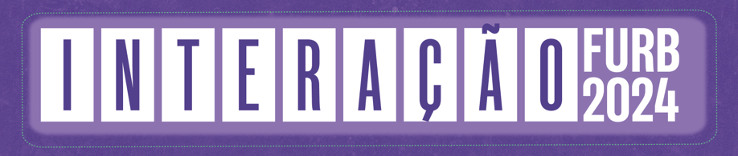
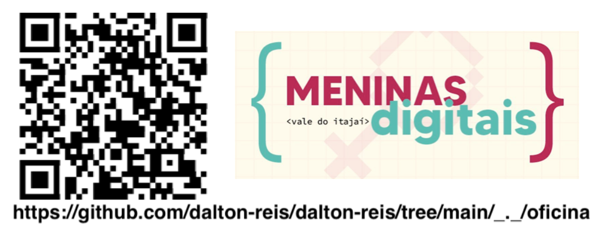
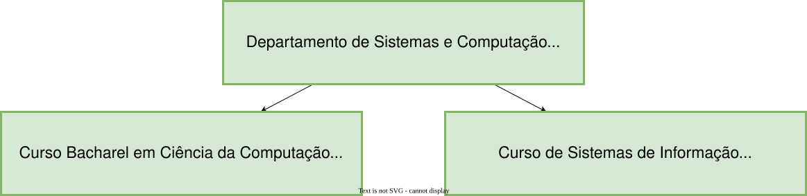
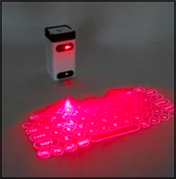
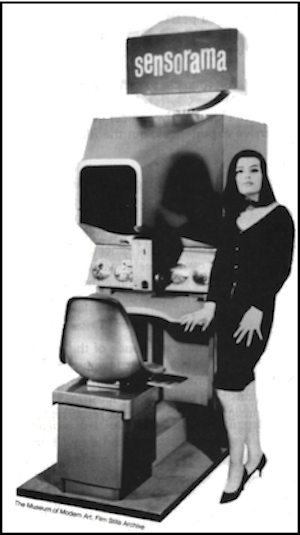
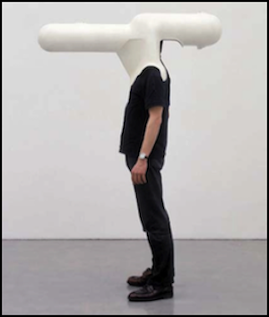
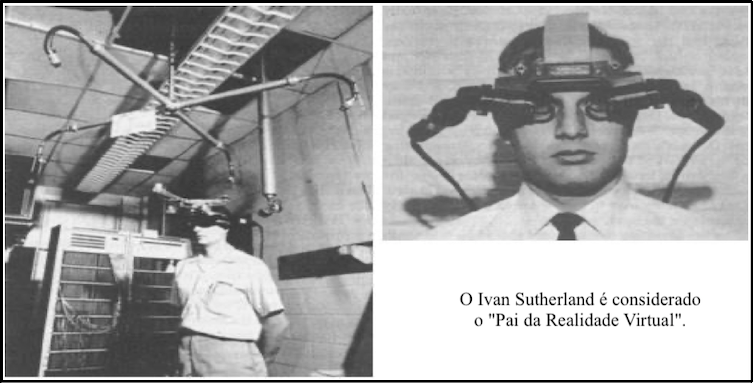
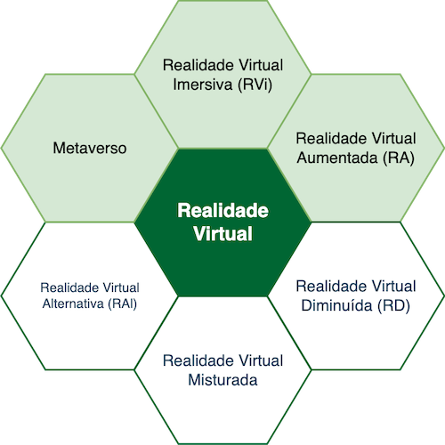
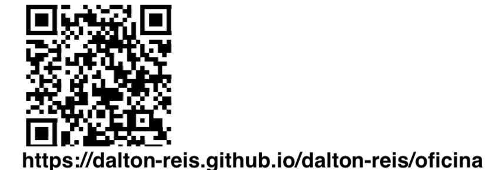

# Da Realidade Virtual ao Metaverso

## Meninas Digitais - FURB

<!--    -->
<!-- # Formação Pomerode -  FURB 2024  -->

   
         Nome: Dalton Solano dos Reis  
         Contato: [dalton@furb.br](mailto://dalton@furb.br "dalton@furb.br ")  
 
  

<!-- 
----
## Departamento de Sistemas e Computação - DSC

- 50 anos  
- muitas vagas de emprego  
- dupla titulação  
- universidade gratuita  

  

[Material sobre os cursos](./_/_._/OLD/2024_DSC.pdf "Material sobre os cursos")  

### Nossos cursos  

- [curso de Bacharel em Ciências da Computação](https://www.furb.br/pt/graduacao/ciencia-da-computacao "curso de Bacharel em Ciências da Computação")  
- [curso de Sistemas de Informação](https://www.furb.br/pt/graduacao/sistemas-de-Informacao "curso de Sistemas de Informação")  
 -->
----

Da Realidade Virtual ao Metaverso: o que já fizemos e para onde vamos

## Inquietações

Pensei em algumas perguntas para tentarmos responder  

- Será que Realidade Virtual é algo novo?  
- Eu já usei algo de Realidade Virtual?  
- Eu sei o que é Realidade Virtual?  
- Qual a diferença entre Realidade Virtual e Metaverso? Hum, será que Metaverso é a palavra da "moda".  
- Realidade Virtual veio para ficar, ou é apenas uma "modinha" passageira?  
- Onde se pode usar Realidade Virtual?  
- e outras [perguntas](#perguntas) de vocês no final da apresentação ... assim espero 😁  

## Agenda

- Quem sou eu: [https://github.com/dalton-reis/dalton-reis](https://github.com/dalton-reis/dalton-reis "https://github.com/dalton-reisdalton-reis/")  
- [Conceitos](#conceitos)  
- [Linha do Tempo](#linha-do-tempo)  
- [Tipos de Realidades Virtuais](#tipos-de-realidades-virtuais)  
  - [Realidade Virtual Imersiva (RV / RVi)](_/RealidadeVirtualImersiva.md)  
  - [Realidade Virtual Aumentada (RA)](_/RealidadeVirtualAumentada.md)  
  - [Realidade Virtual Diminuída (RD)](_/RealidadeVirtualDiminuida.md)  
  - [Realidade Virtual Misturada (RM)](_/RealidadeVirtualMisturada.md)  
  - [Realidade Virtual Alternativa (RAl)](_/RealidadeVirtualAlternativa.md)  
  - [Realidade Virtual - Metaverso](_/RealidadeVirtualMetaverso.md)  
- [Para saber mais](_/ParaSaberMais/ParaSaberMais.md)  
- [Aplicativos](_/RealidadeVirtualAplicativos.md)  
- [Perguntas](#perguntas)  
- [Atividade](#atividade)  

## SBGames 2024 - finalista

<https://www.furb.br/pt/noticias/furb-e-finalista-em-quatro-categorias-de-desenvolvimento-de-games-no-sbgames-2024>  

## Conceitos

Antes dos conceitos sobre Realidade Virtual voltamos por um momento a uma das perguntas iniciais ...  

    Eu já usei algo de Realidade Virtual?  

Exemplo sensor de ré do carro com projeção de percurso virtual  

Ponto de ônibus com Realidade Virtual  
  

### Termos

Alguns [termos](#termos "termos") importantes para área da Realidade Virtual.  

#### Imersão

Sentimento de estar-se dentro do ambiente. Ser humano usa os sentidos para perceber o mundo real. Se controlar estes sentidos, se consegue maximizar a imersão no mundo virtual. Uma forma de  "controlar" os sentidos é usando as Ilusões de Ótica.  

[PercepcaoVisual-IlusaoOtica](_/Conceitos/PercepcaoVisual-IlusaoOtica.pdf)  

#### Interação

Está ligada com a capacidade do computador detectar as entradas do usuário e modificar “instantaneamente” o [mundo virtual](#mundo-virtual "mundo virtual") e as ações sobre ele. Se busca por formas mais "naturais" de [Interação](#interação "Interação") para maximizar a [Imersão](#imersão "Imersão").  

##### Teclado Virtual

Alternativas de [Interação](#interação "Interação") usando formas tradicionais  
  

Teclado Virtual (ao vivo 😅)  

##### LeapMotion

Alternativas de [Interação](#interação "Interação") usando formas **não** tradicionais  
  

LeapMotion - Explorando objetos virtuais: "descascador" de gatos  
  

Alguns Trabalhos nossos usando LeapMotion  
 ( 📢 )  

#### Envolvimento

Tange ao grau de motivação para conectar ("ligar") a pessoa com uma determinada atividade.  

#### Mundo Real

Mundo físico onde vivemos.  

#### Mundo Virtual

Mundo modelado virtualmente por modelos de computação gráfica que podem simular o [mundo real](#mundo-real "mundo real").  

#### Ancora RA

Forma de ancorar ("grudar") um objeto virtual ([mundo virtual](#mundo-virtual "mundo virtual")) em um objeto real ([mundo real](#mundo-real "mundo real")).  

### Linha do Tempo

Alguns pontos marcantes na história da Realidade Virtual: Sensorama, Helmet e Ivan Sutherland.  

**Sensorama** - espécie de cabine, que combinava filmes 3D, som estéreo, vibrações mecânicas, aromas, e ar movimentado por ventiladores. Patenteado em **1962** por Morton Heilig, o Sensorama já utilizava-se de um dispositivo para visão estereoscópica.  
  

Primeiro capacete de Realidade Virtual (Head Mounted Display - HMD) **Helmet** was made in **1967**.  
  

Sistema criado por **Ivan Sutherland** no ano de 1968, como o objetivo de adicionar informações virtuais sobre os objetos reais, facilitando as tarefas do dia a dia.  

  

Equipamento para Visão Estereoscópica usado no Brasil na época colonial no **museu de Curitiba - PR**.  
  

### Tipos de Realidades Virtuais

Uma forma de conceituar o que é Realidade Virtual e entender os tipos de realidades.

  

## [Realidade Virtual Imersiva (RV / RVi)](_/RealidadeVirtualImersiva.md)  

## [Realidade Virtual Aumentada (RA)](_/RealidadeVirtualAumentada.md)  

## [Realidade Virtual Diminuída (RD)](_/RealidadeVirtualDiminuida.md)  

## [Realidade Virtual Misturada (RM)](_/RealidadeVirtualMisturada.md)  

## [Realidade Virtual Alternativa (RAl)](_/RealidadeVirtualAlternativa.md)  

## [Realidade Virtual - Metaverso](_/RealidadeVirtualMetaverso.md)  

----

## [Para saber mais](_/ParaSaberMais/ParaSaberMais.md)  

## [Aplicativos](_/RealidadeVirtualAplicativos.md)  

## Perguntas  

[Perguntas e-mail: dalton@furb.br](mailto://dalton@furb.br "Perguntas e-mail: dalton@furb.br ")  

<!-- <https://forms.office.com/pages/designpagev2.aspx?origin=OfficeDotCom&lang=pt-BR&sessionid=de2a5e05-60cc-4b3a-944e-b8078f5a0636&route=Templates&subpage=design&id=KiItDNrscEuWCqzvbO0wUkrE9Grf2d5FobLZ7kEfSV9UMUdNNkNOVkFGWUNOODIzTFBWTlVFMVU4Vi4u&analysis=true> -->

   
        Nome: Dalton Solano dos Reis  
        Contato: [dalton@furb.br](mailto://dalton@furb.br "dalton@furb.br ")  

<!--   -->

## Atividade

### Aplicativo ArLab

[ArLab](https://drive.google.com/open?id=1WQD9PBPtEkWwRh__trqi40WfKazLugC_&usp=drive_fs)

### ArtSteps Atividade

Agora vamos desenvolver uma atividade usando um aplicativo de Realidade Virtual utilizando o ArtSteps.  

A atividade pode ser feita em um desktop usando um navegador  
<https://www.artsteps.com/>  

Ou, usando o aplicativo
<https://play.google.com/store/apps/details?id=gr.dataverse.artstepsv2&pcampaignid=web_share>  

Para fazer a atividade siga o roteiro:  

- crie um usuário  
- crie um espaço (ArtWork) com no mínimo 3 sala  
- selecione 3 peças e coloque uma em cada sala  
- posicione o usuário na entrada  
- defina uma rota para visitar as 3 peças (nas salas)  
- publique, e enviei o link para Dalton [https://wa.me/55047991012777](https://wa.me/55047991012777)  

## Agradecimento

Aos Grupos de Pesquisa  

[https://www.furb.br/furbot](https://www.furb.br/furbot "https://www.furb.br/furbot")  
[https://www.furb.br/habitat](https://www.furb.br/habitat "https://www.furb.br/habitat")  

    
