# Da Realidade Virtual ao Metaverso: o que já fizemos e para onde vamos

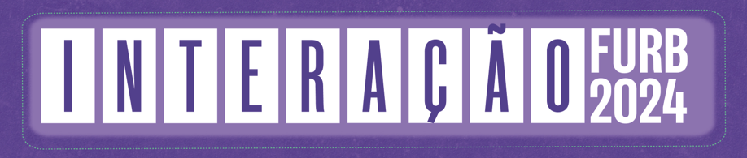  
<!-- # Formação Pomerode -  FURB 2024  -->

 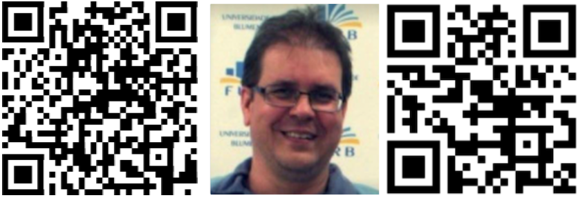  
        Nome: Dalton Solano dos Reis  
        Contato: [dalton@furb.br](mailto://dalton@furb.br "dalton@furb.br ")  

----

## Departamento de Sistemas e Computação - DSC

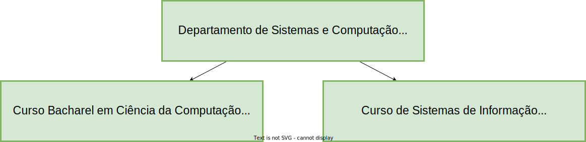  

[Material sobre os cursos](./_/_._/OLD/2024_DSC.pdf "Material sobre os cursos")  

### Nossos cursos  

- [curso de Bacharel em Ciências da Computação](https://www.furb.br/pt/graduacao/ciencia-da-computacao "curso de Bacharel em Ciências da Computação")  
- [curso de Sistemas de Informação](https://www.furb.br/pt/graduacao/sistemas-de-Informacao "curso de Sistemas de Informação")  

## Inquietações

Pensei em algumas perguntas para tentarmos responder  

- Será que Realidade Virtual é algo novo?  
- Eu já usei algo de Realidade Virtual?  
- Eu sei o que é Realidade Virtual?  
- Qual a diferença entre Realidade Virtual e Metaverso? Hum, será que Metaverso é a palavra da "moda".  
- Realidade Virtual veio para ficar, ou é apenas uma "modinha" passageira?  
- Onde se pode usar Realidade Virtual?  
- e outras [perguntas](#perguntas) de vocês no final da apresentação ... assim espero 😁  

## Agenda

- Quem sou eu: [https://github.com/dalton-reis/dalton-reis](https://github.com/dalton-reis/dalton-reis "https://github.com/dalton-reisdalton-reis/")  
- [Conceitos](#conceitos)  
- [Linha do Tempo](#linha-do-tempo)  
- [Tipos de Realidades Virtuais](#tipos-de-realidades-virtuais)  
- [Para saber mais](#para-saber-mais)  
- [Mais Exemplos](#mais-exemplos)  
- [Perguntas](#perguntas)
- [Estações](#estações)  
- [Atividade](#atividade)  

## Conceitos

Antes dos conceitos sobre Realidade Virtual voltamos por um momento a uma das perguntas iniciais ...  

    Eu já usei algo de Realidade Virtual?  

Exemplo sensor de ré do carro com projeção de percurso virtual  

Ponto de ônibus com Realidade Virtual  
  

### Termos

Alguns [termos](#termos "termos") importantes para área da Realidade Virtual.  

#### Imersão

Sentimento de estar-se dentro do ambiente. Ser humano usa os sentidos para perceber o mundo real. Se controlar estes sentidos, se consegue maximizar a imersão no mundo virtual. Uma forma de  "controlar" os sentidos é usando as Ilusões de Ótica.  

[PercepcaoVisual-IlusaoOtica](_/Conceitos/PercepcaoVisual-IlusaoOtica.pdf)  

#### Interação

Está ligada com a capacidade do computador detectar as entradas do usuário e modificar “instantaneamente” o [mundo virtual](#mundo-virtual "mundo virtual") e as ações sobre ele. Se busca por formas mais "naturais" de [Interação](#interação "Interação") para maximizar a [Imersão](#imersão "Imersão").  

##### Teclado Virtual - Alternativas de [Interação](#interação "Interação") usando formas tradicionais  

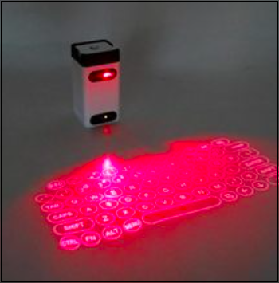  

Teclado Virtual (ao vivo 😅)  

##### LeapMotion - Alternativas de [Interação](#interação "Interação") usando formas **não** tradicionais  

  

LeapMotion - Explorando objetos virtuais: "descascador" de gatos  
  

Alguns Trabalhos nossos usando LeapMotion  
 ( 📢 )  

#### Envolvimento

Tange ao grau de motivação para conectar ("ligar") a pessoa com uma determinada atividade.  

#### Mundo Real

Mundo físico onde vivemos.  

#### Mundo Virtual

Mundo modelado virtualmente por modelos de computação gráfica que podem simular o [mundo real](#mundo-real "mundo real").  

#### Ancora RA

Forma de ancorar ("grudar") um objeto virtual ([mundo virtual](#mundo-virtual "mundo virtual")) em um objeto real ([mundo real](#mundo-real "mundo real")).  

### Linha do Tempo

Alguns pontos marcantes na história da Realidade Virtual: Sensorama, Helmet e Ivan Sutherland.  

**Sensorama** - espécie de cabine, que combinava filmes 3D, som estéreo, vibrações mecânicas, aromas, e ar movimentado por ventiladores. Patenteado em **1962** por Morton Heilig, o Sensorama já utilizava-se de um dispositivo para visão estereoscópica.  
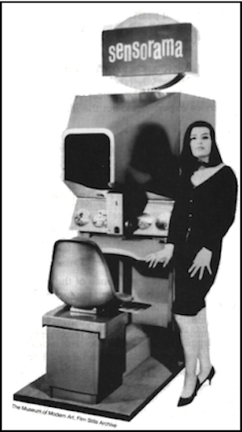  

Primeiro capacete de Realidade Virtual (Head Mounted Display - HMD) **Helmet** was made in **1967**.  
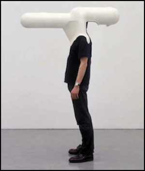  

Sistema criado por **Ivan Sutherland** no ano de 1968, como o objetivo de adicionar informações virtuais sobre os objetos reais, facilitando as tarefas do dia a dia.  

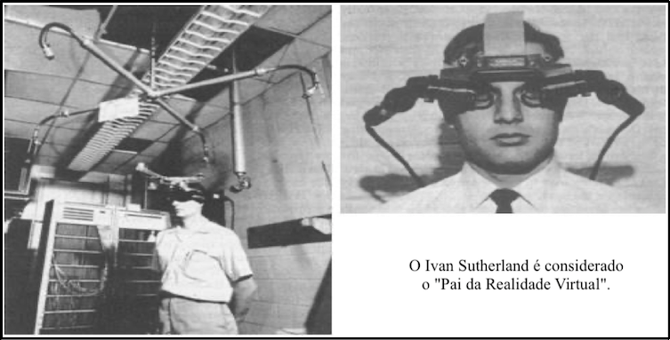  

Equipamento para Visão Estereoscópica usado no Brasil na época colonial no **museu de Curitiba - PR**.  
  

### Tipos de Realidades Virtuais

Uma forma de conceituar o que é Realidade Virtual e entender os tipos de realidades.

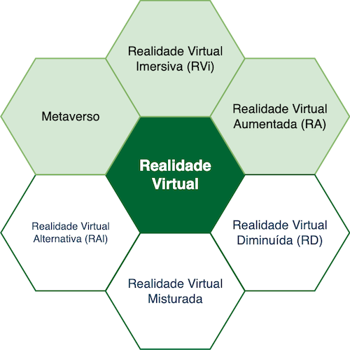  

#### [Realidade Virtual Imersiva (RV / RVi)](_/RealidadeVirtualImersiva.md)  

#### [Realidade Virtual Aumentada (RA)](_/RealidadeVirtualAumentada.md)  

#### [Realidade Virtual Diminuída (RD)](_/RealidadeVirtualDiminuida.md)  

#### [Realidade Virtual Misturada (RM)](_/RealidadeVirtualMisturada.md)  

#### [Realidade Virtual Alternativa (RAl)](_/RealidadeVirtualAlternativa.md)  

#### [Realidade Virtual - Metaverso](_/RealidadeVirtualMetaverso.md)  

## [Para saber mais](_/ParaSaberMais/ParaSaberMais.md)  

## Perguntas  

[Perguntas e-mail: dalton@furb.br](mailto://dalton@furb.br "Perguntas e-mail: dalton@furb.br ")  

<!-- <https://forms.office.com/pages/designpagev2.aspx?origin=OfficeDotCom&lang=pt-BR&sessionid=de2a5e05-60cc-4b3a-944e-b8078f5a0636&route=Templates&subpage=design&id=KiItDNrscEuWCqzvbO0wUkrE9Grf2d5FobLZ7kEfSV9UMUdNNkNOVkFGWUNOODIzTFBWTlVFMVU4Vi4u&analysis=true> -->

   
        Nome: Dalton Solano dos Reis  
        Contato: [dalton@furb.br](mailto://dalton@furb.br "dalton@furb.br ")  

<!--   -->
## Estações

Alguns exemplos de aplicativos desenvolvidos pelo nosso grupo na área de Realidade Virtual.  

### Hardware

#### Teclado Virtual  

[Teclado Virtual](#teclado-virtual---alternativas-de-interação-usando-formas-tradicionais)  

#### LeapMotion  

[LeapMotion](#leapmotion---alternativas-de-interação-usando-formas-não-tradicionais)  

#### Óculos RV (Flip)  

#### CardBoard  

### Aplicativos: RVi

Exemplos de aplicativos de [Realidade Virtual Imersiva](#realidade-virtual-imersiva-rv--rvi)  

#### Defesa Civil

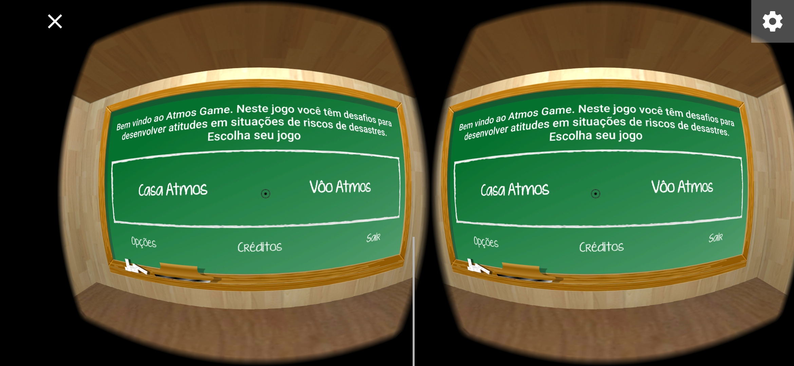  
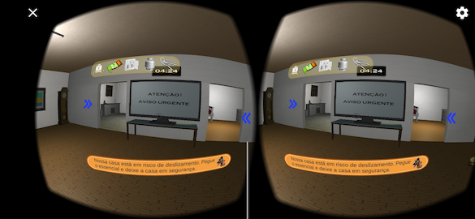  
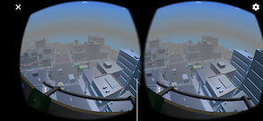  

APK: <https://drive.google.com/open?id=1HnItO60iTpd3bTNIxkrSBpxTurWLvP_r&usp=drive_fs>  

#### Consequências

APK: <https://play.google.com/store/apps/details?id=br.furb.ldtt.consequencia&pcampaignid=web_share>  

#### FlorestaSC RA

<https://play.google.com/store/apps/details?id=br.furb.ldtt.FlorestaSCRA&pcampaignid=web_share>  
APK Teste: <https://drive.google.com/open?id=1PdJE8w7lk_oM_3i3FGqbLUFsLnPq1lqu&usp=drive_fs>  

#### RotaVR

<https://drive.google.com/open?id=1MJHWtljPopyy1pGD6fpGqROa6Pd63t9J&usp=drive_fs>  

#### ARVid

Somente para iOS.  
APP: <https://apps.apple.com/br/app/arvid-augmented-reality/id1276546297>  

#### ArtSteps

APP: <https://www.artsteps.com/>  

### Aplicativos: RA

Exemplos de aplicativos de [Realidade Virtual Aumentada](#realidade-virtual-aumentada-ra)  

#### Sistema Solar

<https://drive.google.com/open?id=1HtcHBJPeKmqdLl3YRtqeZuq7zjI40Ywz&usp=drive_fs>  

#### LibrAR

...  

#### ProgramAR

<https://drive.google.com/open?id=1MLkthrt-5_h1ndjDtJ6IcFczIvQuJkpr&usp=drive_fs>  

#### Trunfo / QuimicAR

<https://play.google.com/store/apps/details?id=br.furb.ldtt.SuperTrunfo&pcampaignid=web_share>  

#### RelevoAR

<https://drive.google.com/open?id=1G-x-NFZKhtD6KF9xKW8bTyF-bsNeeHX5&usp=drive_fs>  

#### Caixa D'Areia

[Caixa D'Areia](#caixa-e-água---caixa-de-areia-interativa)  

#### AnimAR

<https://drive.google.com/open?id=16rirGv0Ix4XJa5QjgzoV2kgRAG_Xiul5&usp=drive_fs>  

#### Acroboard

<https://drive.google.com/open?id=1-FuOGDWHad1txz-duBmWBFB6wWLBi6jv&usp=drive_fs>  

#### Artivive

[Artivive](https://artivive.com/)  

#### AugmentedClass

[AugmentedClass](https://www.creativitic.es/augmentedclass/)  

## Atividade

### ArtSteps Atividade

Agora vamos desenvolver uma atividade usando um aplicativo de Realidade Virtual utilizando o ArtSteps.  

A atividade pode ser feita em um desktop usando um navegador  
<https://www.artsteps.com/>  

Ou, usando o aplicativo
<https://play.google.com/store/apps/details?id=gr.dataverse.artstepsv2&pcampaignid=web_share>  

Para fazer a atividade siga o roteiro:  

- crie um usuário  
- crie um espaço (ArtWork) com no mínimo 3 sala  
- selecione 3 peças e coloque uma em cada sala  
- posicione o usuário na entrada  
- defina uma rota para visitar as 3 peças (nas salas)  
- publique, e enviei o link para Dalton [https://wa.me/55047991012777](https://wa.me/55047991012777)  

## Agradecimento

Aos Grupos de Pesquisa  

[https://www.furb.br/furbot](https://www.furb.br/furbot "https://www.furb.br/furbot")  
[https://www.furb.br/habitat](https://www.furb.br/habitat "https://www.furb.br/habitat")  

    
