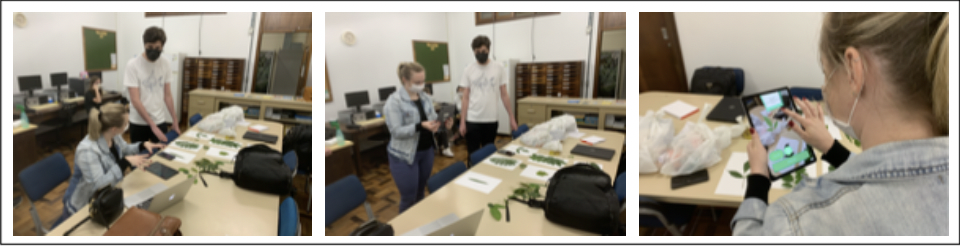
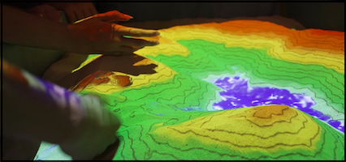
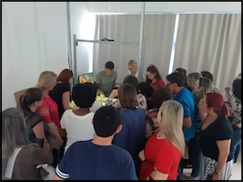
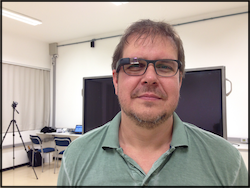

# Realidade Virtual Aumentada (RA)  

Uma aplicação de RA também é RV, mas uma aplicação de RV não é RA. Pois as aplicações que usam RA devem ter três características: combinar real com virtual, ter [interação](../README.md#interação "interação") em "tempo real" e usar o espaço 3D.  

Alguns pontos que devem ser observados:

- mistura do virtual com real;  
- único sentido: do virtual para real ou real para virtual (mais comum);  
- necessidade de marcadores (âncoras) no [mundo real](../README.md#mundo-real "mundo real").  

## RA - Exemplos

Rótulos de Garrafas ( 📢 )  
  

Mesa Tátil da TV Globo  
  

Painel de Fotos com Jogadores ( 📢 )  
  

FolhAR - Explorando Folhas de Plantas com Realidade Aumentada  
  
[2021 - Bruno Geiser Vigentas](https://github.com/gcgfurb/tcc_BrunoGeislerVigentas/blob/main/Textos/tcc_bcc_2021_1_bvigentas_BrunoGeiserVigentas-VF.pdf "2021 - Bruno Geiser Vigentas")  

### Caixa E-Água - Caixa de Areia Interativa

[http://caixae-agua.blogspot.com/p/projeto-nome-da-capes-adiconar.html](http://caixae-agua.blogspot.com/p/projeto-nome-da-capes-adiconar.html "http://caixae-agua.blogspot.com/p/projeto-nome-da-capes-adiconar.html")  

[LCC - SARndbox](https://www10.furb.br/manuais/manual-caixa-de-areia.php "LCC - SARndbox")  
Projeto realizado com base nos projetos Caixa E-Água e da University of California.  

Alguns momentos da Caixa E-Água

  
  

[Mais da Caixa E-Água](../_/Nossos/CaixaEAgua/ "Mais da Caixa E-Água")  

[Home Design](https://apps.apple.com/br/app/home-design-3d/id463768717https://apps.apple.com/br/app/home-design-3d/id463768717 "Home Design") (ao vivo 😅)  

FES - Sistema Solar (ao vivo 😅)  

[2017 - Evandro Matheus Schmitz](https://www.furb.br/dsc/arquivos/tccs/monografias/2017_1_evandro-matheus_monografia.pdf "2017 - Evandro Matheus Schmitz")  

## RA - Hardwares

Google Glass  
  

[Novo Google Glass](https://olhardigital.com.br/2019/05/20/noticias/google-anuncia-oculos-de-realidade-aumentada-com-visual-mais-comum/ "Novo Google Glass")  

[LIDAR - LIght Detection And Ranging](https://pt.wikipedia.org/wiki/Lidar "LIDAR - LIght Detection And Ranging")  
  
[2021 - Bruno Henrique de Borba](https://github.com/gcgfurb/tcc_BrunoHenriqueBorba/blob/main/tcc_bcc_2021_2_bhborba_BrunoHenriqueDeBorba/Textos/tcc_bcc_2021_2_bhborba_BrunoHenriqueDeBorba-VF.pdf "2021 - Bruno Henrique de Borba")  
 ( 📢 )  

[Qualcomm Snapdragon XR2 5G Platform - Local](./Conceitos/HMD_QualcommSnapdragonXR25G.mov "Qualcomm Snapdragon XR2 5G Platform - Local")  
[Qualcomm Snapdragon XR2 5G Platform](https://www.youtube.com/watch?v=b_MMypnh_AI "Qualcomm Snapdragon XR2 5G Platform")  
