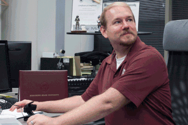

# Realidade Virtual Diminuída (RD)  

Uma aplicação de RD também é RV, mas uma aplicação de RV não é RD. Nas aplicações de RD o principal objetivo é "Esconder" objetos no [mundo real](../README.md#mundo-real "mundo real") usando objetos do [mundo virtual](../README.md#mundo-virtual "mundo virtual").  

Alguns pontos que devem ser observados com a RD:

- utilizado normalmente em produções de vídeo/imagens, onde elementos não desejáveis precisam ser removidos;  
- pode permitir que o usuário remova objetos de vídeos em tempo real;  
- pode ser utilizado em conjunto com a realidade aumentada, para proporcionar uma
experiência de [imersão](../README.md#imersão "imersão") maior;  

## RD - Exemplos

Remoção de objetos com um fundo complexo - [Chroma Key](https://pt.wikipedia.org/wiki/Chroma_key "Chroma Key") sem ter um fundo de cor fixa (ambiente estruturado).  
  

Remoção de objetos usando tablet em ambiente não estruturado.  
  

Remoção de objetos com seleção de região ([Region Of Interest - ROI](https://en.wikipedia.org/wiki/Region_of_interest "Region Of Interest - ROI")) em ambiente não estruturado.  
  
