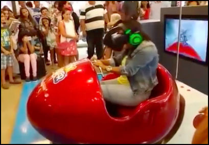

# Realidade Virtual Imersiva (RV / RVi)

A RV pode ser classificada conforme o nível de [interação](../README.md#interação "interação") do usuário com o sistema de RV, em **imersiva** e **não-imersiva**. É **imersiva** quando o usuário é transportado para o domínio da aplicação de RV, com a utilização de ferramentas que auxiliem na [imersão](../README.md#imersão "imersão"), como, por exemplo, capacete e luva para simulação de visão e tato, auxiliando a sensação de estar dentro de um [mundo virtual](../README.md#mundo-virtual "mundo virtual"). E é **não-imersiva** quando o usuário é transportado para o domínio da aplicação parcialmente, interagindo com um [mundo virtual](../README.md#mundo-virtual "mundo virtual") sem fazer parte dele, como, por exemplo, a utilização de monitor e projeção.  

Alguns pontos que devem ser observados para aumentar a [imersão](../README.md#imersão "imersão"):

- representar do [mundo virtual](../README.md#mundo-virtual "mundo virtual") que permita a [imersão](../README.md#imersão "imersão") do usuário (quanto mais crível melhor);  
- controlar os “sentidos” proporciona [imersão](../README.md#imersão "imersão") (mais comum: visão e tato);  
- poder interagir ou não com o que vê ao seu redor.

A Realidade Virtual Imersiva (RVi) procura trazer o usuário da aplicação para o ambiente virtual, já a Realidade Aumentada (RA), mantém o usuário no seu ambiente físico e transporta o ambiente virtual para o espaço do usuário, permitindo a [interação](../README.md#interação "interação") com o [mundo virtual](../README.md#mundo-virtual "mundo virtual"), de maneira mais natural e sem necessidade de treinamento ou adaptação.  

Uma aplicação de RVi também é RV, mas uma aplicação de RV não é RVi.  

## RVi - Hardwares

De uma forma geral, independente de qual tipo de Realidade Virtual se pretende usar é interessante pensar como o hardware pode proporcionar entrada, processamento e saída.  
Alguns exemplos de equipamentos usados em RVi.  

## Data Gloves - Luvas

Conhecidas como Luvas de Dados etc. Permite rastrear os movimentos das mãos e ter a sensação de tato. O LeapMotion não da retorno de tato.  

  

## Head-Mounted Display - Capacetes

Conhecidos como óculos virtuais, cardboard etc.  

  
  
  
  
  
  
  

  

Uso do Oculus Quest 2 por professores da FURB.  
  

Uso do Oculus Quest 2 por professores da FURB - vídeo completo.  
[HMD_Habitat_2021_2](./Conceitos/HMD_Habitat_2021_2.mp4 "HMD_Habitat_2021_2")  

Uso do Oculus Quest 2 por professores da FURB - TCCs.  
[2021 - Gabriel Garcia Salvador](https://github.com/gcgfurb/tcc_GabrielGarciaSalvador/blob/master/Textos/tcc_bcc_2021_1_gabrielgarcia_gabrielgarciasalvador-VF.pdf "2021 - Gabriel Garcia Salvador")  
[2021 - Leonardo Rovigo](https://github.com/gcgfurb/tcc_LeonardoRovigo/blob/main/Textos/tcc_bcc_2021_1_lrovigo_LeonardoRovigo-VF.pdf "2021 - Leonardo Rovigo")  

### Vision Pro - Apple

[https://www.apple.com/apple-vision-pro/](https://www.apple.com/apple-vision-pro/)  

## SmartPhones e outros

Uma das grande limitações atuais é gerar espaços virtuais ([Mundo Virtual](../README.md#mundo-virtual "Mundo Virtual") para ser usado na área da Realidade Virtual.  

Braçadeira Myo  
  

## RVi - Exemplos

Um exemplo de uso de RV é um usuário utilizando uma ferramenta de modelagem 3D (ex. Sketchup), e de RVi é quando o usuário coloca um HMD que "fecha" todo campo de visão do usuário, ou até mesmo "controlando" outros sentidos, e assim aumentando a [imersão](../README.md#imersão "imersão") deste usuário.  

A RVi explora o uso HMD para "controlar" o campo de visão do usuário.  

Quanto mais controle dos sentidos, mais imersão, então se explora o uso de equipamentos para dar um retorno de Tato.  

  
